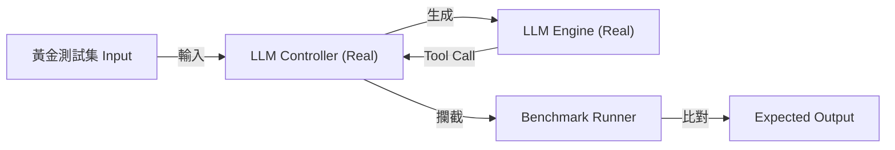

# LLM Benchmark Methodology (認知能力評測)

本文件說明 `scripts/agent/benchmarks/simple_bench.py` 如何評估 LLM Agent 的認知能力，並解釋其與真實運作環境的關係。

## 1. 核心評測機制：意圖攔截 (Intent Interception)

評測系統採用「意圖攔截」機制：我們不看 LLM "說了什麼"，而是看它 "想做什麼"。

### 流程圖


### 與真實環境的差異
使用者最關心的問題是：**「這是否真的反映了 XBrainLab 的 LLM 能力？」**

答案是：**是的。**

評測腳本 (`simple_bench.py`) 匯入了 **真實的專案程式碼**：
```python
# scripts/agent/benchmarks/simple_bench.py
from XBrainLab.llm.agent.controller import LLMController
```

*   **真實的部分 (Real)**：
    *   `LLMController`: 負責對話管理、Prompt 構建。
    *   `AgentWorker`: 負責 LLM 推論流程。
    *   `LLMEngine`: 負責載入本地模型 (e.g., Qwen-7B)。
    *   **結論**：Agent 的「大腦」與生產環境**完全一致**。

*   **模擬的部分 (Mock)**：
    *   `Study` (Backend): 由於我們只評測「Agent 想不想呼叫工具」，而不需要「真的去讀取 GDF 檔案」，因此後端執行層被 Mock 掉了。
    *   **優點**：這讓評測速度極快，且不需要準備數 GB 的真實腦波數據即可驗證 Agent 邏輯。

## 2. 黃金測試集 (Gold Set)

測試集位於 `scripts/agent/benchmarks/data/gold_set.json`，格式如下：

```json
{
    "id": "dataset_02",
    "category": "dataset",
    "input": "Load subject1.gdf",
    "expected_tool_calls": [
        {
            "tool_name": "load_data",
            "parameters": {"paths": ["subject1.gdf"]}
        }
    ]
}
```

*   **Input**: 模擬使用者的自然語言指令。
*   **Expected**: 標準答案（預期的工具名稱與參數）。

## 3. 評分標準

系統會比對 Agent 輸出的 `Actual Tool Call` 與 `Expected`：

1.  **工具名稱 (Exact Match)**：必須完全一致。
2.  **參數 (Subset Match)**：
    *   Agent 必須包含所有 Expected 的參數。
    *   參數值必須一致 (允許字串化後的寬容比對)。
    *   Agent 若多傳了額外的預設參數 (如 `run_id=None`)，**判定為 Pass** (容錯設計)。

## 4. 如何執行

```bash
# 執行完整評測 (需 NVIDIA GPU)
poetry run benchmark-llm
```

## 5. 常見問題

*   **Q: 為什麼 UI 分數較低？**
    *   A: UI 導航指令較為抽象，且目前的 Prompt 對於 Panel 切換的定義較少，未來可透過優化 System Prompt 改善。
*   **Q: 這能測出幻覺 (Hallucination) 嗎？**
    *   A: 可以。如果 Agent 在不需要時呼叫了不存在的工具，或參數亂編，會導致比對失敗 (Fail)。
