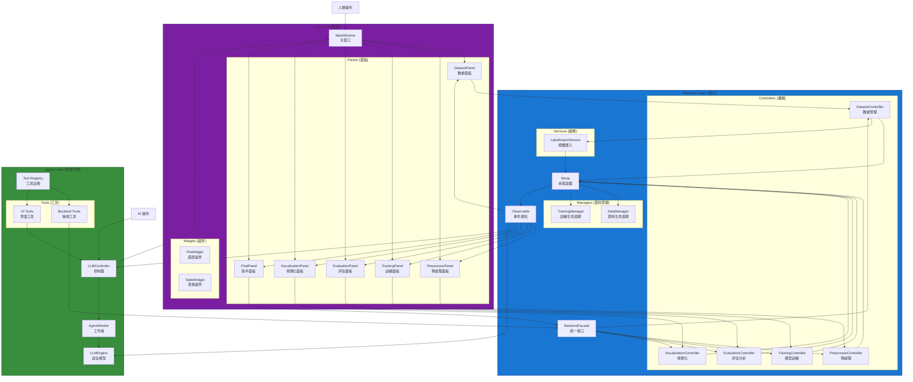

# XBrainLab 架構總覽 (Architecture Overview)

本文檔提供 XBrainLab 整體架構的高層次概述。詳細設計與實現請參考各子目錄的專屬文檔。

## 核心架構原則

XBrainLab 採用 **雙核心驅動 (Dual-Core Driver)** 設計，允許人類使用者 (透過 UI) 與 AI Agent (透過 Facade) 同時操作系統，確保狀態一致性與高可測試性。

### 主要組件

1. **Backend Layer**：系統核心，負責數據處理與邏輯運算。詳見 [Backend](backend.md)。
2. **UI Layer**：用戶界面，被動顯示後端狀態。詳見 [UI](ui.md)。
3. **Agent Layer**：AI 助手，盲眼操作後端。詳見 [Agent](agent.md)。

### 關鍵設計模式

- **Observer Pattern**：實現 UI 與 Backend 的鬆耦合。
- **Facade Pattern**：簡化 Agent 與 Backend 的互動。
- **Headless Design**：Backend 獨立運行，無 GUI 依賴。

## 架構圖

## 系統互動流程

1. **操作發起**：UI 或 Agent 發送指令至 Backend。
2. **狀態更新**：Backend 處理邏輯，更新 Study 狀態。
3. **通知廣播**：Backend 發出事件通知。
4. **響應刷新**：UI 接收通知，拉取最新狀態並更新顯示。

此設計確保無論操作來源，系統狀態始終同步。

## 三系統互動詳解

XBrainLab 的核心創新在於 Backend、UI 與 Agent 三個系統的協同運作，實現人類與 AI 的無縫整合。

### 1. Backend 作為中央樞紐
- **狀態管理**：Study 持有所有數據與模型，是唯一真理來源。內部委派至 `DataManager`（資料生命週期）與 `TrainingManager`（訓練生命週期）。
- **邏輯執行**：Controllers 處理具體業務，Services 提供通用功能。
- **事件驅動**：Observable 廣播狀態變化，觸發 UI 更新與 Agent 響應。

### 2. UI 作為被動界面
- **顯示狀態**：Panels 與 Widgets 將 Backend 狀態視覺化呈現。
- **接收輸入**：人類操作通過 Panels 發送指令至 Controllers。
- **自動刷新**：訂閱 Observable 事件，主動拉取最新數據更新界面。

### 3. Agent 作為智慧代理
- **獨立操作**：Agent 通過 Facade 直接訪問 Backend，無需 UI 中介。
- **自然語言**：支援 LLM 驅動的指令解析與任務執行。
- **背景運行**：可在無 UI 環境下運作，或與 UI 並行操作。
- **RAG 增強**：整合知識庫檢索，提升決策準確性。

### 互動場景示例

#### 場景 1: 人類載入數據
1. 用戶在 DatasetPanel 選擇文件並點擊載入。
2. DatasetPanel 呼叫 DatasetCtrl.load_data()。
3. DatasetCtrl 更新 Study，觸發 Observable 通知。
4. UI Panels 接收通知，拉取新數據刷新顯示。
5. Agent 可同時感知變化，準備後續操作。

#### 場景 2: Agent 執行訓練
1. Agent 解析用戶指令，決定啟動訓練。
2. Agent 通過 Facade 呼叫 TrainingCtrl.start_training()。
3. TrainingCtrl 執行訓練邏輯，更新 Study 狀態。
4. Observable 廣播訓練進度事件。
5. UI TrainingPanel 接收通知，更新進度條與圖表。
6. 用戶可實時監控 Agent 的操作。

#### 場景 3: 同時操作
- 用戶在 UI 修改參數，Agent 在背景優化模型。
- 兩者共享同一 Study 實例，狀態始終同步。
- 事件通知確保雙方互不干擾。

此設計實現了高度的靈活性：UI 提供直觀操作，Agent 提供智慧自動化，Backend 確保一致性與可擴展性。

## 架構優點

- **模組化**：各層獨立開發與測試。
- **可擴展性**：易於添加新功能而不影響現有代碼。
- **可測試性**：Headless Backend 支持全面自動化測試。
- **用戶體驗**：雙核心允許同時操作，提升效率。

## 擴充規範 (Extension Guide)

若要新增新的分析功能（如新的濾波器或模型）：
1. 在 Service 層實作底層算法（如 `LabelImportService`）。
2. 在對應 Controller 中暴露調用介面（如 `PreprocessController`）。
3. 在 `BackendFacade` 中新增統一入口方法。
4. 更新 Agent 的 Tool Definition（`llm/tools/definitions/`）以支援新指令。
5. 新增 Real Tool 實作（`llm/tools/real/`），連接 Facade 方法。

## 潛在挑戰

- **複雜性**：Observer 模式需仔細管理事件依賴。
- **性能**：大數據集處理需優化記憶體與 GPU 使用。
- **同步**：確保 UI 與 Agent 操作的一致性。

更多細節請參考各組件專屬文檔。
