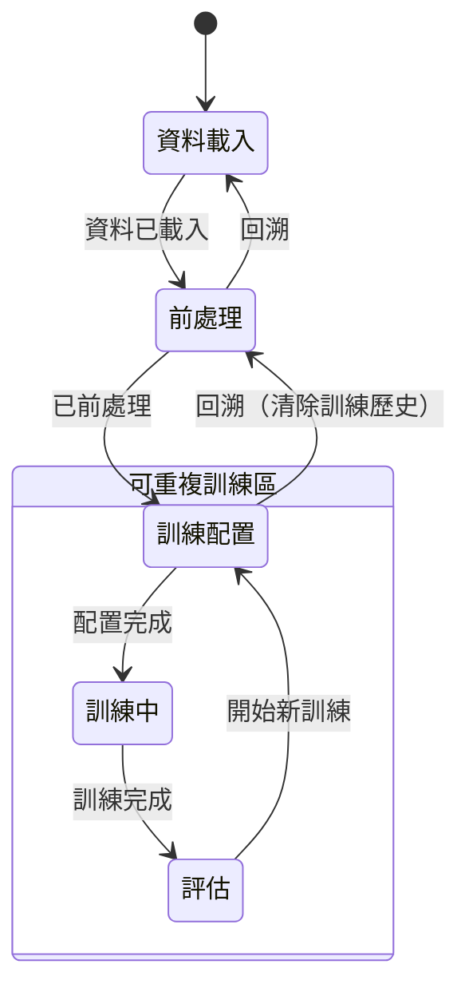

# ADR-005：統一狀態與鎖定系統（UI 與 LLM Agent）

- **狀態**: 提議中 (Proposed)
- **日期**: 2026-02-02
- **作者**: XBrainLab 團隊

---

## 背景

目前的「鎖定」機制存在以下問題：

1. **分散式管理**：各 Controller 各自維護 `is_locked()` 狀態
2. **僅限 UI**：鎖定邏輯未延伸至 LLM Agent 的工具可用性
3. **非黑即白**：無法「跳階並使用預設值」或「回溯到先前階段」

---

## 決策

實作**統一狀態與鎖定系統**，具備：

1. **集中式狀態管理**：`StateManager` 服務統一管理
2. **階段感知工具控制**：根據當前階段開放工具
3. **跳階機制**：確認對話框 + 預設值套用
4. **回溯機制**：支援細粒度回溯選項
5. **全域清除工具**：`clear_dataset` 在所有階段可用，需使用者確認

---

## 狀態機設計

### 核心特性：可重複訓練

訓練不修改資料，完成後可返回「訓練配置」進行新一輪訓練。



---

## 清除與回溯工具

### 1. 重置前處理（前處理階段專用）

```python
def reset_preprocessing() -> ResetResult:
    """
    清除所有前處理設定，保留原始資料。
    回到「資料已載入」狀態，可重新執行前處理。
    """
```

### 2. 清除資料集（全域可用）

```python
def clear_dataset(confirm: bool = False) -> ClearResult:
    """
    清除整個資料集（包含原始資料和所有後續狀態）。
    所有階段皆可使用，執行前顯示影響範圍。
    回到「初始狀態」。
    """
```

**設計原則**：永遠不阻止使用者清除資料，但必須明確告知影響範圍。

---

## 後端決定當前階段

**關鍵原則**：階段判斷由後端執行，LLM 不需猜測。

### StateManager 提供階段資訊

```python
class StateManager:
    def get_current_stage(self) -> Stage:
        """後端根據實際狀態判斷當前階段"""
        if not self.has_data:
            return Stage.IDLE
        if not self.is_preprocessed:
            return Stage.DATA_LOADED
        if not self.has_training_config:
            return Stage.PREPROCESSED
        if self.is_training:
            return Stage.TRAINING
        return Stage.READY_TO_TRAIN

    def get_available_tools(self) -> list[str]:
        """根據當前階段回傳可用工具"""
        stage = self.get_current_stage()
        return STAGE_TOOLS[stage]
```

### Agent Prompt 注入階段資訊

```python
system_prompt = f"""
【當前狀態】
- 階段：{state_manager.get_current_stage().value}
- 可用工具：{state_manager.get_available_tools()}

【規則】
- 只能使用可用工具
- 若使用者要求不可用操作，請說明需先完成什麼
"""
```

**優點**：
- LLM 不需推測階段，減少幻覺
- 工具可用性由後端穩定控制
- 階段轉換邏輯集中管理

---

## 各階段工具可用性

> **待討論**：各階段具體開放哪些工具、哪些需要確認，後續再細化。

---

## 待釐清事項

1. **StageStatus 枚舉**：`NOT_STARTED | IN_PROGRESS | COMPLETED | SKIPPED`
2. **自動階段推進**：系統偵測條件滿足後自動推進，非 Agent 手動呼叫
3. **錯誤恢復策略**：操作失敗時保持原階段，提供錯誤訊息

---

## 實作階段

1. **Phase 1**：StateManager 核心 + 觀察者通知
2. **Phase 2**：UI 整合（對話框、按鈕狀態）
3. **Phase 3**：Agent 整合（工具定義、動態 Prompt）
4. **Phase 4**：智慧預設值（Future Work - EEG 知識）
