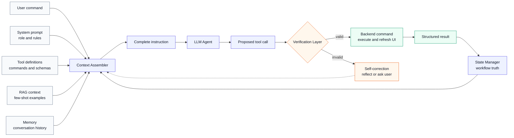

# Target Agent

最後更新：`2026-05-02`

這份文件定義 XBrainLab agent 的目標態。

## 角色

XBrainLab 的 assistant 是 app 內 EEG workflow operator。

它不是：

- 普通聊天插件。
- 外部 coding assistant。
- 只會描述 UI 的 help bot。

它應該能：

- 讀取目前 workflow state。
- 選擇合適工具。
- 呼叫 backend command。
- 解釋它做了什麼。
- 在錯誤或缺資料時回報可行下一步。

## Local-only runtime

產品 runtime 已是 local-only。

這代表：

- `LLMConfig`、`LLMEngine`、`AgentWorker` 不接受 Gemini / remote API 作為產品
  execution mode。
- remote backend modules 已從 product package 移除；舊 settings / env 若指向
  `api` / `gemini`，必須 migrate local 或 fail closed，不可 instantiate remote backend。
- `openai` / `google-genai` 不在 default dependencies；若歷史研究需要，只能放在 optional
  `legacy-remote-llm` dependency group / legacy fixture，不可由 product code import。
- local model cache、dependency、GPU / CPU fallback 要可檢查。
- model switch、stop generation、timeout、VRAM diagnostics 要可驗證。
- 真 local LLM 長時間 ChatPanel walkthrough 仍未完成，不能用 prompt smoke 取代。

## Tool-call validation

tool-call validation 不只看回答像不像，也不應停在人工讀幾個範例。

目標是建立一套可重跑的 agent tool-call scoring system，用固定 benchmark cases 評估 agent 在 XBrainLab workflow 中的操作準確率。

它應驗證：

- intent 是否映射到正確 command。
- tool selection 是否正確。
- command input / parameters 是否正確。
- command 是否真的執行。
- 執行後 state 是否正確變化。
- error 是否可分類、可回報、可恢復。
- 多步 workflow 是否能維持 state。

評分輸出至少應包含：

- overall tool-call accuracy。
- 分項 accuracy：intent、tool、parameters、state transition、error recovery。
- per-stage accuracy：data import、preprocess、dataset、training、evaluation、visualization。
- invalid call rate。
- unsafe / blocked call rate。
- self-correction success rate。
- case-level failure taxonomy。

benchmark cases 應包含：

- single-turn workflow command。
- multi-turn workflow sequence。
- missing-data / wrong-stage request。
- ambiguous user intent。
- invalid parameter。
- recovery after validation failure。
- state update after backend execution。

這套 scoring system 才是 thesis evidence 的核心之一；dashboard clean 只能證明工程健康，不能替代 tool-call 準確率評估。

## Target control loop

目標 agent 不是一次 prompt 直接打 backend。它應該是一個有狀態、有驗證、有回饋的 control loop：

這張圖定義的是目標設計，不代表目前程式碼已完整符合。

## Context Assembler

Context Assembler 的責任是把使用者指令轉成 LLM 可以判斷的完整上下文。

它應組合：

- system prompt：agent 角色、工作流規則、安全邊界。
- tool definitions：目前 backend command、schema、前置條件、輸出格式。
- RAG context：少量可驗證的 few-shot workflow examples。
- memory：conversation history 和使用者當前意圖。
- state snapshot：由 State Manager 提供的 workflow stage、資料狀態、訓練狀態和可用 command。

Context Assembler 不應直接執行 backend 操作。它只負責讓 LLM 在正確上下文中提出候選 tool call。

## State Manager

State Manager 是 assistant 看到的 workflow truth。

它不應只是聊天記憶，而應整理 app 本體狀態：

- workflow stage：empty、data loaded、preprocessed、dataset ready、training、trained 等。
- data state：raw、preprocessed、epoch、dataset 是否存在。
- training state：是否正在訓練、是否已有模型、是否有 evaluation result。
- UI / command availability：目前哪些 command 可以執行，哪些需要先完成前置步驟。
- recent tool result：上一個 command 成功、失敗、錯誤類型和可恢復建議。

State Manager 的輸出會回饋到 system prompt 和 tool definitions。這代表 prompt 不是靜態文字，而是會跟著 app 狀態縮小或調整可用操作範圍。

## Verification Layer

Verification Layer 是 LLM 和 backend command 之間的安全邊界。

它應在執行前檢查：

- intent 和 tool 是否匹配。
- tool 是否允許在目前 workflow stage 執行。
- required inputs 是否完整。
- input schema、型別、範圍是否有效。
- file path、dataset、label、model、training option 是否存在或可解析。
- destructive / long-running command 是否需要 human confirmation。
- confidence 是否足夠；不足時不直接執行。

驗證失敗時，不應直接吞掉錯誤或硬跑 backend。它應產生可回饋給 LLM 的 structured error，讓 Self-Correction 重新檢查 intent、補參數或向使用者提問。

## Target contracts

以下 contract 是目標外框，不是最終完整 schema。具體 command 欄位要等 Application Service / Command API 第一版切片出來後再定。

### State Snapshot Contract

State Snapshot 是 State Manager 輸出給 Context Assembler、Verification Layer 和 scorer 的狀態快照。

它至少應包含：

- `workflow_stage`：目前整體 workflow 摘要，例如 `empty`、`data_loaded`、`preprocessed`、`dataset_ready`、`training`、`trained`。這只能作為 summary，不能作為唯一狀態模型。
- `data_state`：目前 active dataset pipeline 的 raw、preprocessed、epoch、dataset 是否存在，以及目前資料的基本 metadata。目標先維持一次只有一個 active dataset pipeline。
- `label_state`：event / label mapping 是否存在、是否和資料相容。
- `training_state`：是否正在訓練、是否已有 model、是否有 metrics / result。長期應能描述多個 training job / experiment run。
- `visualization_state`：目前是否具備可視化前置條件，例如 trained model、channel info、montage；應能指向特定 trained result，而不是只看全域 `trained` stage。
- `capability_policy`：由 backend / Application Service 產生的 command gate，列出目前允許、阻擋、需要確認的 command。
- `available_commands`：目前允許執行的 command / tool。這是 backend capability policy 的輸出，不是把所有 tool 丟給 agent 後讓 agent 自己猜。
- `blocked_commands`：目前不能執行的 command，以及 blocked reason。這主要給 Verification Layer、scorer、debug 和 UI 診斷使用，不代表要把完整 blocked list 塞進 LLM prompt。
- `active_jobs`：目前正在跑的長任務，例如 training、資料處理或 evaluation。
- `completed_runs`：已完成的訓練 / evaluation / visualization result，可供比較、重用或後續分析。
- `last_tool_result`：上一個 command 的 success / failure、error category 和可恢復建議。

重要原則：State Snapshot 不能成為第二份 backend truth。它應從 Application Service / Study / managers 讀出，而不是自己維護一套獨立狀態。

另一個重要原則：command gate 應由 backend / Application Service 控制。agent 可以提出意圖和候選 tool call，但不能拿到所有 tool 後自行決定哪些一定可執行。Context Assembler 應只把目前 policy 允許或需要確認的 capability 暴露給 LLM；Verification Layer 仍要在執行前再次檢查。

`blocked_commands` 可以保留在完整 State Snapshot / capability policy 中，但 Context Assembler 應保守使用：只在和當前 user intent 相關時，把 blocked reason 摘要給 LLM。完整 blocked list 應優先給 verifier、scorer、debug report 和 UI diagnostics。

workflow state 不應只用一個 stage 字串描述，但目標也不是同時開多個 active dataset。比較合理的模型是：

- 一次只有一個 active dataset pipeline。
- epoch / dataset 形成後，不應把 `load_data` 或 `generate_new_dataset` 當成一般可用 command，避免覆蓋或污染目前 pipeline。
- 同一個 dataset 可以產生多個 training run / evaluation result。
- 已完成的 run 可以看 evaluation / visualization / saliency。
- 使用者可以比較不同 run。

但這不代表所有 command 都可以並行或任意執行。每個 command 仍有 dependency gate：

- 沒有 loaded data，不能 preprocess。
- 沒有 label / event 對齊，不能產生可信 dataset。
- 沒有 dataset，不能 start training。
- 沒有 trained result，不能跑 saliency / model-based visualization。
- 某個 resource 正在被 long-running job 寫入時，不能同時對同一個 resource 做破壞性操作。
- epoch / dataset 形成後，如果要載入新資料或開新 dataset，必須走明確的 reset / new session / fork 類 command，且需要使用者確認。

因此 `workflow_stage` 只是摘要；真正的 State Snapshot 應以 active dataset pipeline、jobs、results 為核心，並由 capability policy 逐一判斷每個 command 對特定 resource 是否可執行。

### Tool Call Contract

Tool Call Contract 是 LLM 提出的候選操作格式。

它至少應包含：

- `intent`：使用者意圖的結構化描述。
- `tool_name`：候選 tool / command 名稱。
- `arguments`：符合 tool input schema 的參數。
- `target_resource`：此 tool call 要操作的資料、dataset、training job、model 或 result。
- `confidence`：LLM 對此 tool call 的信心。
- `assumptions`：LLM 做出的假設，例如預設資料、預設 channel 或預設 training option。
- `requires_confirmation`：是否涉及 destructive / long-running / high-impact 操作。
- `reason`：簡短說明為什麼選這個 tool。

Tool Call Contract 不應直接等於自然語言回覆。自然語言可以附帶說明，但 scorer 和 verifier 應讀 structured tool call。

### Verification Result Contract

Verification Result Contract 是 Verification Layer 對候選 tool call 的輸出。

它至少應包含：

- `valid`：是否允許執行。
- `decision`：`allow`、`block`、`repair`、`ask_user`、`confirm`。
- `policy_source`：允許或阻擋此 command 的 backend capability policy 版本 / 來源。
- `blocked_reason`：被擋下的原因，例如 wrong stage、missing data、invalid parameter、unsafe action。
- `missing_inputs`：缺少哪些必要參數。
- `normalized_arguments`：驗證後可交給 backend command 的參數。
- `required_confirmation`：需要使用者確認的原因與確認訊息。
- `suggested_repair`：給 Self-Correction 的修正建議。
- `verifier_notes`：可寫入 report 的診斷資訊。

這個 contract 是防止 agent 直接亂跑 backend 的主要邊界。

### Scoring Contract

Scoring Contract 是 thesis evaluation 工具用來評分的資料格式。

每個 benchmark case 至少應包含：

- `case_id`。
- `user_command`。
- `initial_state`。
- `target_resource`。
- `expected_intent`。
- `expected_tool_name`。
- `expected_arguments`。
- `expected_verification_decision`。
- `expected_state_delta`。
- `expected_error_category`，若此 case 是錯誤或 recovery case。

每次 run 至少應產生：

- `actual_tool_call`。
- `verification_result`。
- `backend_result`，若有執行 backend command。
- `state_before` / `state_after`。
- `capability_policy`。
- `score_breakdown`：intent、tool、parameters、verification、state transition、error recovery。
- `failure_category`。
- `notes`。

scorer 的目標不是只給一個總分，而是能指出 agent 是錯在意圖理解、工具選擇、參數、狀態判斷、執行結果，還是錯誤恢復。

## Tool surface 方向

tool surface 不應被舊工具 taxonomy 綁住。

未來工具應以 workflow intent 設計，例如：

- load data
- attach labels
- inspect current state
- apply preprocessing
- generate dataset
- configure training
- start / stop training
- evaluate model
- explain validation state

tool 的輸出應該是 structured result，而不是只靠自然語言。

每個 tool 應明確標示：

- input schema。
- required state。
- side effect。
- result schema。
- error category。
- 是否需要 confirmation。

## 和 backend 重構的關係

agent redesign 不應早於 backend command surface。

合理順序是：

1. 先完成全盤架構複盤。
2. 盤點 backend controller workflow logic。
3. 建立 Application Service / Command API 的第一個可用切片。
4. 讓 agent tools 包 command，而不是直接包 controller。
5. 建立 State Manager 和 Verification Layer 的第一版 contract。
6. 建立 State Snapshot、Tool Call、Verification Result、Scoring 的第一版 schema。
7. 建立 agent tool-call scoring system。
8. 再做 tool-call validation 和 thesis evidence collection。

## 目前不能宣稱

- 不能宣稱真 local LLM 長時間 ChatPanel walkthrough 已完成。
- 不能宣稱 tool-call workflow 已完整驗證。
- 不能宣稱 State Manager / Verification Layer 已完成。
- 不能宣稱 tool-call 準確率已被 thesis-grade 評估。
- 不能把 mock tool tests 當成 real workflow evidence。
- 不能把 dashboard PASS 當成 agent thesis claim 已成立。
