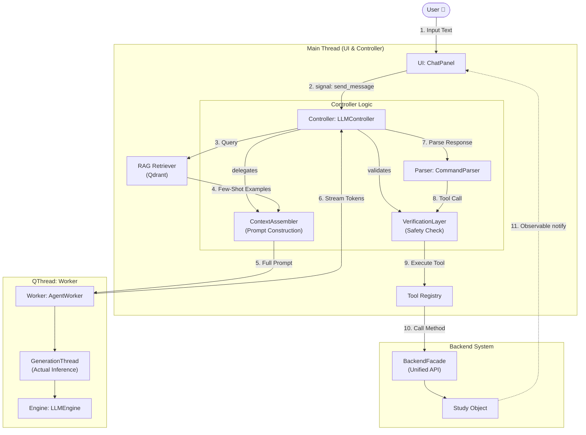

# Agent Architecture (Agent 架構設計)

**最後更新**: 2026-02-25

## 1. 系統綜覽 (System Overview)

XBrainLab 的 Agent 系統採用 **"Headless Backend + Intelligent Bridge + RAG"** 的設計模式。
Agent 扮演「操作員」的角色，它不直接持有數據，而是透過標準化的 **Tools** 介面來操作後端的 **Study** 物件，並通過 **RAG** 檢索知識庫來增強決策能力。



## 2. 核心元件 (Core Components)

### 2.1 Agent Controller (`controller.py`)
**職責**: Agent 的中樞神經，協調 User、LLM、RAG 與 Tools 之間的訊息傳遞與狀態管理。

**主要屬性**:
- `history`: 對話歷史（Sliding Window, `MAX_HISTORY = 20`）
- `assembler`: `ContextAssembler` — 動態組裝 System Prompt + Tool Definitions + RAG Context
- `verifier`: `VerificationLayer` — 驗證 Tool Call 的合法性
- `worker` / `worker_thread`: 背景推論執行緒
- `rag_retriever`: RAG 語義檢索器

**主要方法**:
- `handle_user_input(text)`: 接收 UI 輸入 → 查詢 RAG → 觸發生成
- `_generate_response()`: 透過 Assembler 組合完整 Prompt，發送給 Worker
- `_on_generation_finished()`: 解析 LLM 回應，進入 ReAct Loop
- `_process_tool_calls()`: 執行工具呼叫，結果回饋 LLM 循環
- `stop_generation()`: 中斷生成並發出 `processing_finished` 信號

**安全機制**:
- `_loop_break_count` / `_max_loop_breaks = 3`: 防止無限迴圈偵測失效
- `_tool_failure_count` / `_max_tool_failures = 3`: 工具連續失敗上限
- `try/except` 包裝 `handle_user_input`，確保異常時重置 `is_processing`

### 2.2 Context Assembler (`assembler.py`)
**職責**: 動態組裝 AI 的認知上下文，整合四大元件：
1. **System Prompt** — 定義 Agent 角色與 ReAct 推理模式
2. **Tool Definitions** — 根據後端狀態動態插入可用工具 Schema
3. **RAG Context** — 從 Qdrant 檢索的 Few-Shot 相似案例
4. **Memory** — 對話歷史（Sliding Window）

### 2.3 Verification Layer (`verifier.py`)
**職責**: 在執行 Tool Call 前的安全檢查：
- **腳本驗證**: 檢查 Tool Call 是否符合語法與邏輯（如參數範圍）
- **信心度檢查**: 評估 LLM 的信心度
- **低信心 / 無效** → 觸發自我修正（Reflection），將錯誤回饋給 Assembler 重試
- **高信心 & 有效** → 執行工具

> **注意**: 信心度檢查目前尚未完全啟用（見 KNOWN_ISSUES.md）。

### 2.4 Agent Worker (`worker.py`)
**職責**: 在獨立 QThread 中執行 LLM 推論，避免阻塞 UI。

**類別**:
- `GenerationThread(QThread)`: 實際呼叫 `engine.generate_stream()` 並透過信號發送 Chunk
- `AgentWorker(QObject)`: 管理 LLM Engine 生命週期，啟動 GenerationThread

### 2.5 Command Parser (`parser.py`)
**職責**: 解析 LLM 文字輸出，提取 JSON 工具指令。
- 使用 Regex 尋找 `` ```json ... ``` `` 區塊
- 驗證 JSON 格式
- 回傳 `(command_name, parameters)` 或 `None`

### 2.6 LLM Engine (`core/engine.py`)
**職責**: 封裝模型載入與推論，支援混合推論引擎 (Hybrid Inference Engine)。

**支援模式**:
| 模式 | Backend | 說明 |
|------|---------|------|
| **Local** | `LocalBackend` | Qwen2.5-7B-Instruct（免費、離線、需 GPU） |
| **API** | `OpenAIBackend` | GPT-4o / DeepSeek（高準確率、需 API Key） |
| **Gemini** | `GeminiBackend` | Gemini 2.0 Flash（免費、快速、需 API Key） |

**資料處理範圍**:
- ✅ LLM 處理: 使用者指令、Tool 執行結果描述、檔案路徑
- ❌ LLM 看不到: EEG Raw Data、模型權重、實際數據內容

### 2.7 RAG Engine (`rag/`)
**職責**: 為 LLM 提供特定領域的知識與 Few-Shot 相似案例檢索。

**模組**:
- `indexer.py`: 文件索引邏輯（Qdrant Local Mode）
- `retriever.py`: 語義相似度檢索器
- `evaluation.py`: Hit Rate、MRR 評估
- `storage/`: Qdrant 本地儲存

**索引資料**:
| 資料來源 | 用途 | 優先級 |
|---------|------|--------|
| `gold_set.json`（50 題） | Few-Shot 範例 | P0 |
| `tool_definitions.md` | 工具參數規格 | P0 |
| `GLOSSARY.md` | 領域知識 | P2 |

### 2.8 Tool Registry (`tools/`)
**架構**: 採用 Factory Pattern 與分層設計。

```
tools/
├── definitions/          # Base Classes (工具介面定義)
│   ├── dataset_def.py    # ListFiles, LoadData, AttachLabels, ClearDataset,
│   │                     # GetDatasetInfo, GenerateDataset
│   ├── preprocess_def.py # BandPassFilter, NotchFilter, Resample, Normalize,
│   │                     # Rereference, ChannelSelection, SetMontage, EpochData,
│   │                     # StandardPreprocess
│   ├── training_def.py   # SetModel, ConfigureTraining, StartTraining
│   └── ui_def.py         # SwitchPanel
├── mock/                 # Mock 實作 (用於 Benchmark 評測)
├── real/                 # Real 實作 ✅ 已完成 (19/19)
│   ├── dataset_real.py   # → BackendFacade
│   ├── preprocess_real.py
│   ├── training_real.py
│   └── ui_control_real.py
├── base.py               # Tool Base Class
├── tool_registry.py      # ToolRegistry 動態管理
└── __init__.py           # AVAILABLE_TOOLS 工廠
```

## 3. 資料流與互動機制

### 3.1 角色職責
- **UI 層**: `ChatPanel` — 只負責「顯示」與「接收輸入」
- **Controller 層**: `LLMController` — 記憶對話、決策（ReAct Loop）、解析工具指令、調度 Worker
- **Worker 層**: `AgentWorker` + `GenerationThread` — 在獨立 QThread 中執行 LLM 推論

### 3.2 詳細資料傳輸流程

#### 階段一：使用者輸入 (UI → Controller)
1. 使用者在 `ChatPanel` 輸入指令
2. `ChatPanel` → `MainWindow` → `agent_controller.handle_user_input()`

#### 階段二：思考與推論 (Controller ↔ Worker)
3. Controller 將訊息加入 `history`（Sliding Window）
4. Controller 查詢 `RAGRetriever.get_similar_examples(text)`
5. `ContextAssembler` 組合 System Prompt + Tools + RAG Context + History
6. 發出 `sig_generate` → Worker（跨執行緒邊界）
7. `GenerationThread` 執行 LLM 推論，串流回傳

#### 階段三：執行與回應 (Controller → Backend → UI)
8. `CommandParser` 解析回應：
   - **純對話**: 發出 `response_ready` → UI 顯示
   - **工具呼叫 (ReAct Loop)**:
     1. `VerificationLayer` 驗證 Tool Call
     2. 執行工具 → 操作 `BackendFacade` → 修改 `Study` 狀態
     3. 工具結果加入 history，重新觸發生成（Loop）

### 3.3 UI 刷新機制

**核心原則**: Agent/Tool **不直接操作 UI**。UI 刷新由 Observer Bridge 觸發。

```
Agent Tool (Worker Thread)
    │ exec: facade.apply_filter()
    ▼
Backend Observable ── notify("preprocess_changed") ──►
    │
    ▼ (Background Thread → Main Thread, QueuedConnection)
QtObserverBridge ── Qt Signal ──► UI Panel.update()
```

## 4. 專案結構 (LLM Module)

```
XBrainLab/llm/
├── agent/                    # 控制層
│   ├── controller.py         # 協調者 (Main Thread, ReAct Loop)
│   ├── assembler.py          # Prompt 組裝器 (System+Tools+RAG+History)
│   ├── verifier.py           # 驗證層 (Safety Check)
│   ├── worker.py             # 執行者 (Worker Thread, LLM Inference)
│   └── parser.py             # 輸出解析 (JSON Tool Call Parser)
│
├── core/                     # LLM 引擎層
│   ├── config.py             # 模型設定 (支援 Local/API/Gemini)
│   ├── engine.py             # 推論引擎 (Backend 工廠)
│   ├── downloader.py         # 模型下載進度
│   └── backends/             # 推論後端
│       ├── base.py           # BaseBackend 抽象類別
│       ├── local.py          # HuggingFace Transformers (4-bit 量化)
│       ├── api.py            # OpenAI-compatible API
│       └── gemini.py         # Google Gemini API
│
├── tools/                    # 工具介面層 (Factory Pattern)
│   ├── definitions/          # Base Classes (19 個工具介面)
│   ├── mock/                 # Mock Implementation (用於 Benchmark)
│   ├── real/                 # Real Implementation ✅ (19/19)
│   ├── base.py               # Tool Base Class
│   ├── tool_registry.py      # ToolRegistry 動態管理
│   └── __init__.py           # AVAILABLE_TOOLS 工廠
│
└── rag/                      # RAG 檢索模組
    ├── indexer.py            # 文件索引 (Qdrant Local Mode)
    ├── retriever.py          # 語義檢索器
    ├── evaluation.py         # Hit Rate, MRR 評估
    ├── config.py             # Qdrant 配置
    └── storage/              # Qdrant 本地儲存

相關資料:
├── scripts/agent/benchmarks/
│   ├── simple_bench.py           # Benchmark 評測腳本
│   └── data/
│       └── external_validation_set.json  # OOD 測試集 (175 題) ❌ 不索引
│
└── scripts/agent/debug/
    ├── all_tools.json            # Interactive Debug 全工具腳本
    ├── debug_filter.json         # 濾波測試腳本
    └── debug_ui_switch.json      # UI 切換測試腳本
```

**核心設計原則**:
1. **資料分離**: RAG 訓練資料 (gold_set) 與測試資料 (external_validation_set) 嚴格分離，避免 Data Leakage。
2. **模組化**: Agent, Core, Tools, RAG 各司其職，介面清晰。
3. **可測試性**: Mock/Real 分離，支援單元測試與整合測試。
4. **可擴展性**: Factory Pattern 支援動態切換 Tool 實作與 LLM Backend。
