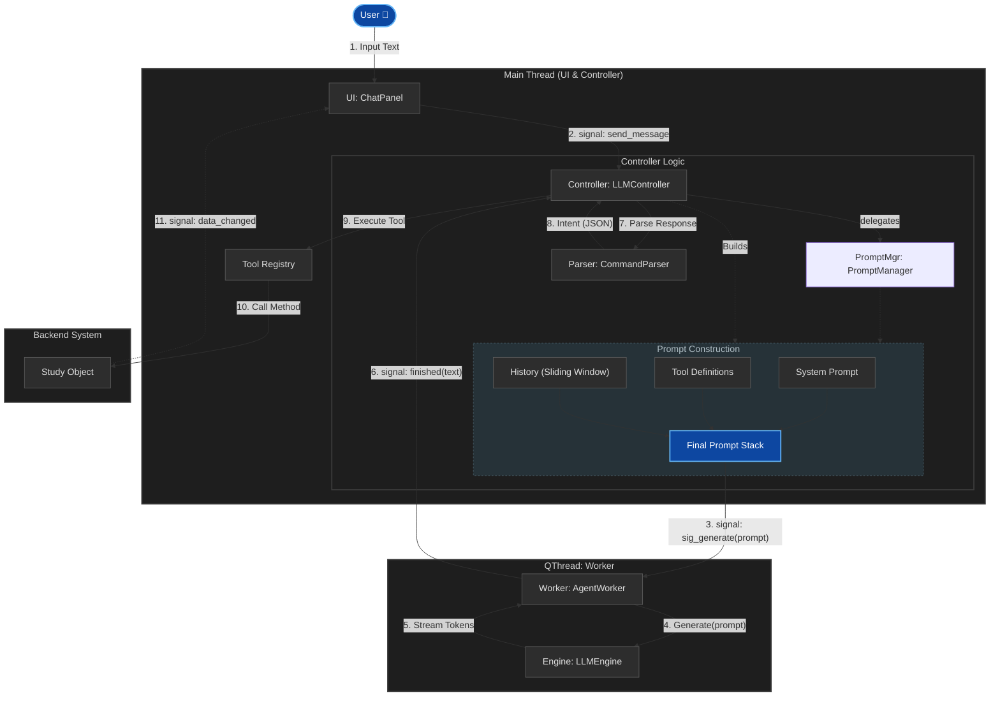

# Agent Architecture (Agent 架構設計)

## 1. 系統綜覽 (System Overview)

XBrainLab 的 Agent 系統採用 **"Headless Backend + Intelligent Bridge + RAG"** 的設計模式。
Agent 扮演「操作員」的角色，它不直接持有數據，而是透過標準化的 **Tools** 介面來操作後端的 **Study** 物件，並通過 **RAG** 檢索知識庫來增強決策能力。



## 2. 核心元件 (Core Components)

### 2.1 Agent Controller (The Brain Stem)
*   **職責**: 負責協調 User, LLM, RAG 與 Tools 之間的訊息傳遞與狀態管理。
*   **核心模組**: `XBrainLab/llm/agent/controller.py`
*   **功能**:
    *   維護對話歷史 (Message History)。
    *   **RAG 整合**: 將 User Query 傳送至 RAG Engine，獲取相關文檔或範例，並注入 System Prompt。
    *   解析 LLM 回傳的 Tool Call 請求。
    *   在 Python 環境中執行對應的 Tool Class。
    *   **執行緒管理**: 啟動並管理 Worker 執行緒。

### 2.2 Agent Worker (The Engine)
*   **職責**: 在獨立執行緒中執行耗時的 LLM 推論。
*   **核心模組**: `XBrainLab/llm/agent/worker.py`
*   **功能**:
    *   載入 LLM 模型。
    *   執行 `generate_stream` 進行推論。
    *   透過 Signal 回傳生成的文字 Chunk 與最終結果。

### 2.3 LLM Engine (The Brain)
*   **職責**: 理解使用者意圖，結合 RAG 提供的背景知識，規劃操作步驟。
*   **核心模組**: `XBrainLab/llm/core/engine.py`
*   **支援模式** (Hybrid Inference Engine):
    *   **Local**: Qwen2.5-7B-Instruct (免費、離線可用、無需 API Key)
    *   **API**: GPT-4o / DeepSeek (高準確率、快速、無需 GPU)
    *   **Gemini**: Gemini 2.0 Flash (免費、快速)
*   **資料處理範圍**:
    *   ✅ LLM 處理: 使用者指令、Tool 執行結果描述、檔案路徑
    *   ❌ LLM 看不到: EEG Raw Data、模型權重、實際數據內容
    *   *註: 所有 EEG 資料保留在 Backend (Study Object)，從不透過 LLM 傳輸*
*   **能力**:
    *   **上下文理解**: 結合 RAG 檢索到的 API 文檔，降低幻覺 (Hallucination)。
    *   **邏輯推理**: 判斷哪些檔案是一組。
    *   **流程規劃**: 決定預處理的順序。
*   **配置管理**: 透過 `LLMConfig` 與 `ConfigManager` 管理模型選擇、API Keys、推論參數。

### 2.4 RAG Engine (The Library)
*   **職責**: 為 LLM 提供特定領域的知識 (Domain Knowledge) 與最新的工具定義，透過 Few-Shot 相似案例檢索提升準確率。
*   **核心模組**: `XBrainLab/llm/rag/` **(Phase 4 規劃中)**
    *   `indexer.py`: 文件索引邏輯 (Qdrant Local Mode)
    *   `retriever.py`: 語義相似度檢索器
    *   `evaluation.py`: Hit Rate, MRR 評估
    *   `storage/`: Qdrant 本地儲存
*   **索引資料來源** (RAG Few-Shot 策略):
    *   **Tool Definitions**: `documentation/agent/tool_definitions.md` (P0 - 工具參數規格)
    *   **Few-Shot Examples**: `scripts/benchmark/data/gold_set.json` (P0 - 50 題精選範例)
    *   **User Manuals**: `documentation/README.md` (P1 - 教學問題)
    *   **EEG Glossary**: `documentation/GLOSSARY.md` (P2 - 領域知識)
*   **檢索策略**:
    *   **Semantic Search**: 根據使用者問題檢索最相似的 3-5 個案例
    *   **Metadata Filtering**: 根據 Tool Category 精準過濾
    *   **Context Injection**: 透過 `PromptManager.add_context()` 注入檢索結果
*   **評估指標**:
    *   Hit Rate (Top-K 檢索準確率)
    *   MRR (Mean Reciprocal Rank)
    *   Faithfulness (Agent 遵守檢索參數的忠實度)

### 2.5 Tool Registry (The Interface)
*   **定義**: 位於 `XBrainLab/llm/tools/`
*   **架構**: 採用 **Factory Pattern** 與 **分層設計**。
    *   `definitions/`: 定義工具介面 (Base Classes)。
    *   `mock/`: 模擬實作 (用於測試與評估)。
    *   `real/`: 真實實作 (連接 Backend) - **✅ 已完成 (19/19 工具)**
    *   `__init__.py`: 負責根據設定 (Mock/Real) 實例化對應的工具集。
*   **工具類別**:
    *   **Dataset**: load_data, attach_labels, list_files, split_dataset
    *   **Preprocessing**: apply_filter, resample, normalize, epoch_data, set_montage
    *   **Training**: configure_training, start_training, get_results
    *   **UI Control**: refresh_ui, show_plot
*   **整合測試**: 透過 `scripts/verify_real_tools.py` 驗證 Backend 整合 (使用真實 EEG 資料)。

### 2.6 Study Object (The State)
*   **定義**: `XBrainLab/backend/study.py`。
*   **職責**:
    *   是整個實驗的 **"Single Source of Truth"**。
    *   持有 Raw Data, Epochs, Training Configuration, Model Weights。

## 3. 資料流與互動機制 (Data Flow & Interaction Mechanism)

本系統採用 **MVC (Model-View-Controller)** 變體設計，利用 Qt 的 **Signal/Slot** 機制實現非同步通訊，確保 UI 流暢度。

### 3.1 角色職責 (Roles)

*   **UI 層 (The Face)**: `MainWindow`, `ChatPanel`
    *   **職責**: 只負責「顯示」與「接收輸入」。完全不處理 LLM 邏輯，不知道 Prompt 存在。
*   **Controller 層 (The Brain)**: `LLMController`
    *   **職責**: 核心指揮官。負責記憶對話 (State)、決策 (ReAct Loop)、解析工具指令，以及調度 Worker。
*   **Worker 層 (The Hand/Engine)**: `AgentWorker`
    *   **職責**: 執行引擎。負責執行最耗資源的 LLM 推論 (Inference)。運作於獨立的 `QThread` 中。

### 3.2 詳細資料傳輸流程 (Detailed Data Flow)

#### **階段一：使用者輸入 (UI -> Controller)**
1.  **使用者**在 `ChatPanel` 輸入指令（如：「幫我載入數據」）。
2.  `ChatPanel` 發出 `send_message` 信號。
3.  `MainWindow` 接收信號，轉發給 `agent_controller.handle_user_input()`。
    *   *此階段僅傳遞字串，UI 執行緒不會阻塞。*

#### **階段二：思考與推論 (Controller <-> Worker)**
4.  **Controller** 將使用者訊息加入 `self.history` (短期記憶)。
5.  **Controller** 組合完整的 Prompt (System Prompt + History)。
6.  **Controller** 發出 `sig_generate` 信號給 **Worker**。
    *   *關鍵點：跨越執行緒邊界 (Thread Boundary)。*
7.  **Worker** (在背景執行緒) 收到信號，呼叫 LLM Engine 進行推論。
8.  **Worker** 推論結束，發出 `finished` 信號，將生成文字傳回 **Controller**。

#### **階段三：執行與回應 (Controller -> UI)**
9.  **Controller** 解析回應文字 (`CommandParser`)：
    *   **情況 A (純對話)**:
        *   LLM 回應普通文字 (如 "你好")。
        *   Controller 發出 `response_ready` 信號 -> UI 顯示文字。
    *   **情況 B (工具呼叫 - ReAct Loop)**:
        *   LLM 回應 JSON 指令 (如 `{"command": "load_data"}`)。
        1.  Controller 發出 `status_update` 信號 -> UI 顯示「正在執行工具...」。
        2.  Controller **執行工具函式** (操作 `Study` 物件)。
        3.  Controller 取得執行結果 (Result)。
        4.  **自動迴圈**: Controller 將 Result 作為新的「觀察」加入歷史，**重複步驟 5**，讓 LLM 根據結果產生最終回應。

### 3.3 UI 刷新機制 (UI Refresh Mechanism)

**核心原則**: Agent/Tool **不直接操作 UI**。UI 刷新由 **Observer Bridge** 觸發。

我們採用 **"Pure Python Observer + Qt Signal Bridge"** 的設計，結合了 Push Model 的即時性與 Decoupling 的優勢。

```text
┌──────────────┐                        ┌──────────────┐
│  Agent Tool  │ exec: import_files()   │   Backend    │ notify("data_changed")
│  (Worker Th) ├───────────────────────►│ (Observable) ├───────────┐
└──────────────┘                        └──────────────┘           │
                                                                   │ Background Thread
                                                                   ▼
┌──────────────┐                        ┌──────────────┐    ┌──────────────┐
│ UI Panel     │ update_panel()         │   QtBridge   │◄───┤ _on_event()  │
│ (Main Thread)│◄───────────────────────┤ (Qt Signal)  │    │              │
└──────────────┘    QueuedConnection    └──────────────┘    └──────────────┘
```

### 3.2 實現方式

1. **Backend (純 Python)**:
   - 使用 `XBrainLab.backend.utils.observer.Observable`。
   - 不依賴 PyQt。
   ```python
   class DatasetController(Observable):
       def import_files(self, paths):
           # ... data loading ...
           self.notify("data_changed")
   ```

2. **Bridge (PyQt)**:
   - `XBrainLab.ui.utils.observer_bridge.QtObserverBridge`。
   - 負責將 Python Event 轉為 Qt Signal，並處理跨執行緒通信。

3. **UI (PyQt)**:
   - 在 `DatasetPanel` 中連接 Bridge。
   ```python
   self.bridge = QtObserverBridge(self.controller, "data_changed", self)
   self.bridge.connect_to(self.update_panel)
   ```

此機制確保了 Agent 在後台執行緒操作時，UI 能夠在主執行緒安全且即時地更新。

### 3.4 Controller 訊號同步機制 (Controller Signal Synchronization)
為了支援 Agent 操作後導致的 UI 更新，`DatasetController` 繼承自 `QObject` 並發出以下信號：
*   `dataChanged`: 當數據集內容變更時（如載入、預處理）。
*   `datasetLocked(bool)`: 當數據集被鎖定/解鎖時。
*   `importFinished(int, list)`: 檔案匯入完成後。

這確保了 Agent 不論是在後台載入數據還是執行預處理，UI 都能即時響應並刷新顯示。

## 4. 專案結構快照 (Project Structure Snapshot - LLM Module Only)

以下展示 `XBrainLab/llm/` 模組的內部結構。

```
XBrainLab/llm/                <-- Agent 核心模組
├── agent/                    <-- 控制層 ✅
│   ├── controller.py         <-- 協調者 (Main Thread, ReAct Loop)
│   ├── worker.py             <-- 執行者 (Worker Thread, LLM Inference)
│   ├── parser.py             <-- 輸出解析 (JSON Tool Call Parser)
│   └── prompt_manager.py     <-- Prompt 建構 (System+History+Tools+RAG Context)
│
├── core/                     <-- LLM 引擎層 ✅
│   ├── config.py             <-- 模型設定 (支援 Local/API/Gemini)
│   └── engine.py             <-- 推論引擎 (Hybrid Inference: LocalBackend, OpenAIBackend, GeminiBackend)
│
├── tools/                    <-- 工具介面層 (Factory Pattern) ✅
│   ├── definitions/          <-- Base Classes (19 個工具介面)
│   │   ├── dataset_def.py
│   │   ├── preprocess_def.py
│   │   ├── training_def.py
│   │   └── ui_def.py
│   ├── mock/                 <-- Mock Implementation (用於 Benchmark)
│   │   └── ...
│   ├── real/                 <-- Real Implementation ✅ 已完成 (19/19)
│   │   ├── dataset_real.py   <-- 連接 DatasetController
│   │   ├── preprocess_real.py
│   │   ├── training_real.py
│   │   └── ui_real.py
│   ├── base.py               <-- Tool Base Class
│   └── __init__.py           <-- Tool Factory (AVAILABLE_TOOLS)
│
└── rag/                      <-- [Phase 4 規劃中] RAG 檢索模組
    ├── __init__.py
    ├── indexer.py            <-- 文件索引邏輯 (index_gold_set, index_documentation)
    ├── retriever.py          <-- 檢索器 (Semantic Search, Metadata Filter)
    ├── evaluation.py         <-- 評估指標 (Hit Rate, MRR, Faithfulness)
    ├── config.py             <-- Qdrant 配置
    └── storage/              <-- Qdrant 本地儲存 (.gitignore)
        ├── gold_set/         <-- Few-Shot 範例索引 (50 題)
        └── docs/             <-- 文件索引 (tool_definitions.md, GLOSSARY.md)

相關資料位置:
├── scripts/benchmark/data/
│   ├── gold_set.json             <-- RAG 訓練範例 (50 題) → 索引到 rag/storage/
│   └── external_validation_set.json  <-- Benchmark 測試集 (175 題) ❌ 不索引
│
└── documentation/agent/
    ├── tool_definitions.md       <-- 工具規格 → 索引到 rag/storage/docs/
    └── agent_architecture.md     <-- 本文件
```

**核心設計原則**:
1. **資料分離**: RAG 訓練資料 (gold_set) 與測試資料 (external_validation_set) 嚴格分離，避免 Data Leakage。
2. **模組化**: Agent, Core, Tools, RAG 各司其職，介面清晰。
3. **可測試性**: Mock/Real 分離，支援單元測試與整合測試。
4. **可擴展性**: Factory Pattern 支援動態切換 Tool 實作與 LLM Backend。
