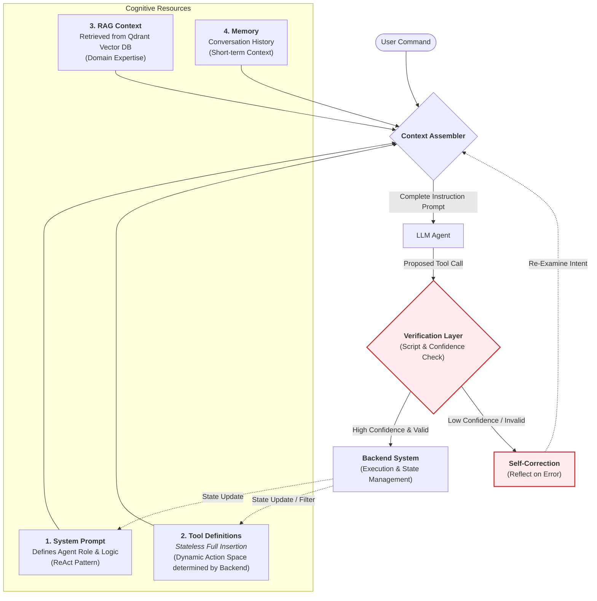

# Context Assembler Architecture (Prompt Assembly 機制)

**最後更新**: 2026-02-25
**狀態**: 已實作（ContextAssembler + VerificationLayer）

本文件描述 XBrainLab Agent 系統的 **Prompt Assembly Architecture**，說明系統如何在呼叫 LLM 前動態組裝 Agent 的認知上下文。

> **相關**: 整體架構圖請見 [agent_architecture.md](agent_architecture.md)

## Context Assembler (Prompt 組裝器)

核心機制是 **Dynamic Context Assembler** (`assembler.py`)，負責將四大元件整合為完整的 Instruction Prompt。

## Key Mechanisms

### 1. Dynamic Tool Definition (Component 2)
**Tool Definitions** 不透過 Semantic Search 檢索，而是根據當前系統狀態 **完整插入**。
- **State-Driven**: Backend 決定哪些工具可用（例如：資料未載入時不顯示 Filter 工具）
- **Full Context**: Agent 看到所有可用工具的完整 Schema，降低 Hallucination

### 2. RAG Context Retrieval (Component 3)
透過 **Qdrant Vector Database** 檢索特定領域知識，為 Agent 提供科學依據與最佳實踐。

### 3. Verification Layer (`verifier.py`)
每個 Tool Call 在執行前經過驗證：
- **Script Validation**: 腳本驗證呼叫的語法與邏輯正確性（如參數範圍）
- **Confidence Check**: 評估 LLM 信心度
  - **Low Confidence / Script Fail** → 觸發 **Self-Correction** (Reflection)
  - **High Confidence & Valid** → 執行 Tool Call

> **目前狀態**: 基本腳本驗證已啟用，信心度檢查尚未完全啟用（見 KNOWN_ISSUES.md）。

### 4. The Assembler (`assembler.py`)
作為認知整合層，融合 User Intent、System Prompt、Tool Logic、RAG Knowledge、Memory 與 Verification Feedback 為單一 Coherent Prompt。
