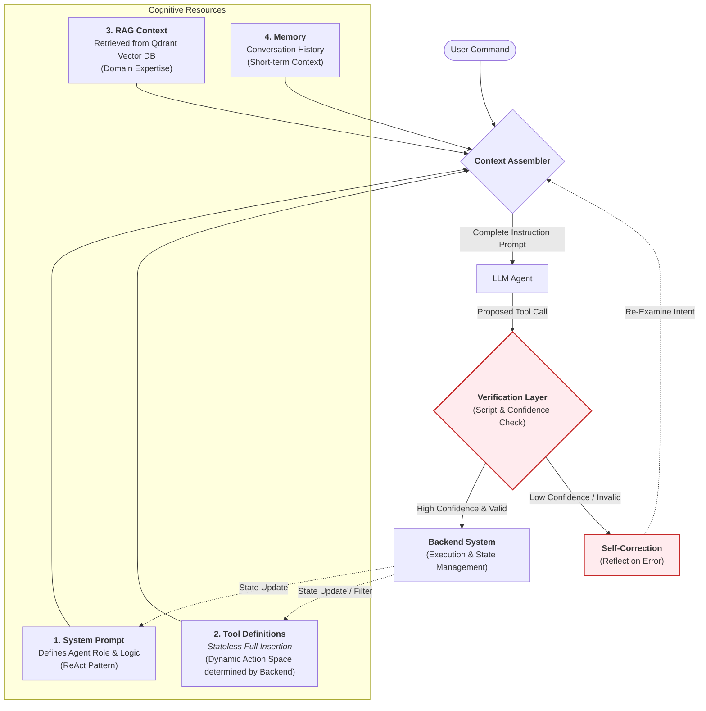

# XBrainLab Future Architecture (Conceptual)

This document outlines the **Prompt Assembly Architecture** of the XBrainLab Agent System. It emphasizes how the system dynamically constructs the AI's cognitive context by assembling four key components before invoking the LLM.

## Conceptual Framework: The Prompt Assembler

The core mechanism is a **Dynamic Prompt Assembler** that gathers the necessary context into a comprehensive "Instruction Box" for the Agent.

## Key Mechanisms

### 1. Dynamic Tool Definition (Component 2)
Crucially, the **Tool Definitions** are not retrieved via semantic search but are **inserted in full** based on the current system state.
- **State-Driven**: The backend determines which tools are valid (e.g., "Filter Data" is only included if data is loaded).
- **Full Context**: The Agent sees the exact schema for all available tools, ensuring precise execution without hallucination.

### 2. Context Retrieval (Component 3)
Domain-specific knowledge is retrieved from the **Qdrant Vector Database** (RAG) to ground the Agent's reasoning in scientific facts and best practices.

### 3. The Verification Layer (Safety & Correction)
Before execution, every proposed Tool Call undergoes a strictly defined check:
- **Script Validation**: A deterministic script checks if the call is syntactically valid and logically sound (e.g., parameter range checks).
- **Confidence Check**: The system evaluates the LLM's confidence.
  - **Low Confidence / Script Fail** → Triggers **Self-Correction** (Reflection), sending the error back to the Assembler to retry.
  - **High Confidence & Valid** → Proceeds to the **Backend System** for execution.

### 4. The Assembler
The Assembler acts as the cognitive integration layer, fusing the User's intent with the System Prompt, Tool Logic, RAG Knowledge, Memory, and any **Feedback from Verification** into a single, coherent prompt.
