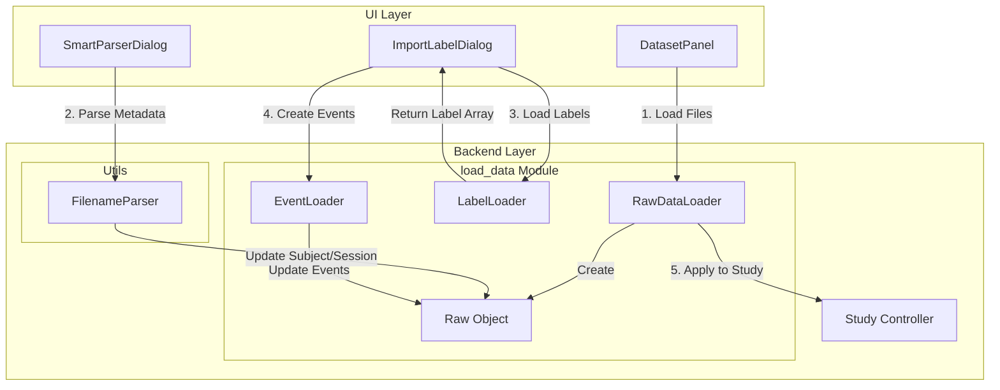

# XBrainLab 系統架構與數據流 (Architecture & Data Flow)

本文件描述 XBrainLab 的高層次架構與核心數據流，旨在幫助開發者理解數據如何在各模組間傳遞。

## 1. 核心控制器: `Study` 物件

`XBrainLab/study.py` 中的 `Study` 類別是整個系統的核心。它是一個 Singleton-like 的控制器，負責管理所有數據的生命週期。

### 1.1 狀態機 (State Machine)
`Study` 物件維護了實驗的當前狀態，數據流向如下：

1.  **Raw Data (原始數據)**
    *   屬性: `self.loaded_data_list`
    *   類型: `List[XBrainLab.load_data.Raw]`
    *   來源: `RawDataLoader` 從 GDF/MAT 檔案讀取。

2.  **Preprocessed Data (預處理數據)**
    *   屬性: `self.preprocessed_data_list`
    *   類型: `List[XBrainLab.load_data.Raw]`
    *   操作: 經過 `Filter`, `Resample`, `ICA` 等處理。
    *   *注意*: 這一步仍然是連續訊號 (Continuous Signal)。

3.  **Epoch Data (切段數據)**
    *   屬性: `self.epoch_data`
    *   類型: `XBrainLab.dataset.Epochs`
    *   操作: 根據 Event Markers 將連續訊號切分為片段 (Trials)。

4.  **Datasets (訓練數據集)**
    *   屬性: `self.datasets`
    *   類型: `List[XBrainLab.dataset.Dataset]`
    *   操作: 根據 `DataSplittingConfig` (如 K-Fold, Train/Test Split) 將 Epochs 分割。

5.  **Training Plan (訓練計畫)**
    *   屬性: `self.trainer`
    *   類型: `XBrainLab.training.Trainer`
    *   內容: 包含模型 (`ModelHolder`)、優化器、訓練參數 (`TrainingOption`)。

## 2. 模組依賴關係 (Module Dependencies)

### 2.1 系統總覽
```mermaid
graph TD
    UI[UI (PyQt)] --> Study[Study Controller]
    Study --> Loader[load_data]
    Study --> Prep[preprocessor]
    Study --> DS[dataset]
    Study --> Train[training]
    
    Loader -->|Raw Object| Prep
    Prep -->|Raw Object| DS
    DS -->|Epochs| Train
    Train -->|Model| Eval[evaluation]
```

### 2.2 Load Data 子系統詳解


## 3. 關鍵元件職責

### 3.1 Load Data
*   **`RawDataLoader`**: 負責讀取 GDF/SET 檔案並封裝成 `Raw` 物件。
*   **`LabelLoader`**: 負責讀取外部標籤檔案 (.txt, .mat)。
*   **`EventLoader`**: 負責將標籤陣列轉換為 MNE Event 格式。
*   **`Raw`**: 資料的基本單位，包裝 MNE 物件並儲存 Metadata。

### 3.2 Utils
*   **`FilenameParser`**: 提供多種策略 (Split, Regex, Folder) 來解析檔名中的 Metadata。

## 4. 關鍵設計模式

*   **Observer Pattern (觀察者模式)**:
    *   UI 面板 (如 `DatasetPanel`) 觀察 `Study` 的狀態變化。雖然沒有顯式的 Observer 介面，但透過 PyQt 的 Signal/Slot 機制，當 `Study` 完成數據加載時，UI 會收到通知並更新。
*   **Strategy Pattern (策略模式)**:
    *   預處理器 (`PreprocessBase`) 和模型定義 (`ModelBase`) 採用策略模式，允許動態替換不同的演算法（如換一個 Filter 或換一個 Neural Network），而不需要修改 `Study` 的核心邏輯。

## 4. 數據結構細節

### 4.1 Raw Object
封裝了 MNE 的 `RawArray`，並增加了對 Event 的管理。
*   `get_data()`: 返回 numpy array (channels x time)。
*   `get_event_list()`: 返回事件列表。

### 4.2 Epochs Object
封裝了 MNE 的 `EpochsArray`。
*   維度: `(n_epochs, n_channels, n_times)`。
