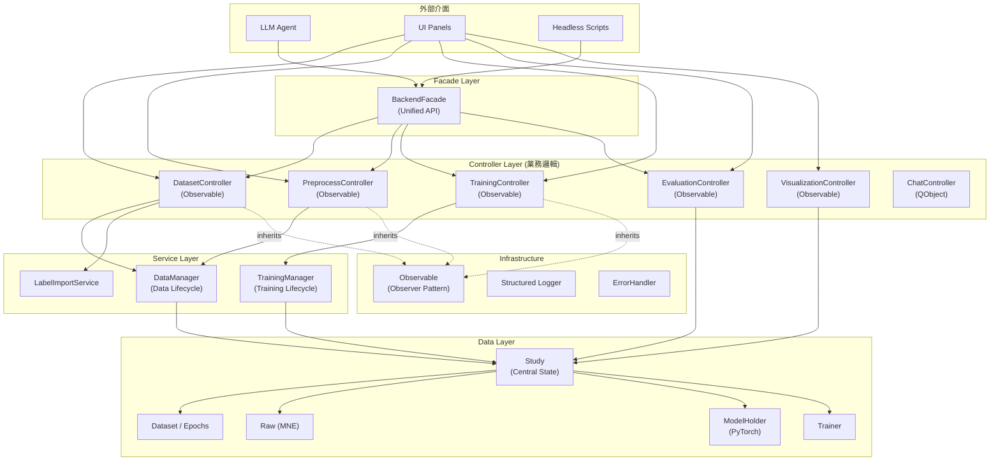

# Backend Architecture (後端架構詳解)

**最後更新**: 2026-02-25

## 1. 設計理念

Backend 採用 **Controller-Service-State** 分層架構，核心目標：

- **Headless 可執行**: Backend 完全不依賴 PyQt6，可在無 GUI 環境下運作
- **單一信任源**: `Study` 物件持有所有實驗狀態
- **Observer 解耦**: 透過 `Observable` 模式通知訂閱者，不直接引用 UI
- **Facade 統一入口**: `BackendFacade` 為 Agent 與腳本提供簡化 API

---

## 2. 系統架構圖



---

## 3. 模組結構

```
XBrainLab/backend/
├── study.py                    # 中央狀態容器 (Single Source of Truth)
├── facade.py                   # 統一 API (供 Agent / Headless 使用)
├── data_manager.py             # 資料生命週期管理
├── training_manager.py         # 訓練生命週期管理 (model/option/plan/execution)
├── exceptions.py               # 自定義 Exception 類別
├── __init__.py
│
├── controller/                 # 業務邏輯層
│   ├── dataset_controller.py   # 資料載入、移除、標籤管理 (Observable)
│   ├── preprocess_controller.py# 濾波、重取樣、重參考、正規化 (Observable)
│   ├── training_controller.py  # 訓練迴圈、進度監控 (Observable)
│   ├── evaluation_controller.py# 評估指標計算 (Observable)
│   ├── visualization_controller.py # Saliency Map、Topomap (Observable)
│   └── chat_controller.py      # 對話相關邏輯 (QObject, 非 Observable)
│
├── dataset/                    # 資料結構
│   ├── dataset.py              # Dataset 類別 (PyTorch Dataset)
│   ├── dataset_generator.py    # Train/Val/Test 分割產生器
│   ├── data_splitter.py        # 分割策略 (KFold, LeaveOneOut, etc.)
│   ├── epochs.py               # MNE Epochs 包裝器
│   └── option.py               # 分割選項 (SplitByType, TrainingType)
│
├── load_data/                  # 資料載入
│   ├── raw.py                  # Raw 物件 (MNE RawArray 包裝)
│   ├── raw_data_loader.py      # 檔案載入器 (GDF/EDF/MAT)
│   ├── data_loader.py          # 格式解析
│   ├── event_loader.py         # 事件/標籤載入
│   ├── label_loader.py         # 外部標籤檔案載入
│   └── factory.py              # Loader Factory Pattern
│
├── preprocessor/               # 預處理操作 (每個繼承 PreprocessBase)
│   ├── base.py                 # PreprocessBase 抽象類別
│   ├── filtering.py            # BandPass / Notch Filter
│   ├── resample.py             # 重取樣
│   ├── rereference.py          # 重參考 (Average / Custom)
│   ├── normalize.py            # Z-Score / Min-Max 正規化
│   ├── channel_selection.py    # Channel 選擇與排除
│   ├── time_epoch.py           # Time-based Epoching
│   ├── window_epoch.py         # Window-based Epoching
│   ├── edit_event.py           # Event 編輯
│   └── export.py               # 資料匯出
│
├── model_base/                 # DNN 模型定義 (PyTorch nn.Module)
│   ├── EEGNet.py               # EEGNet (Lawhern et al., 2018)
│   ├── SCCNet.py               # SCCNet (Wei et al., 2019)
│   └── ShallowConvNet.py       # ShallowConvNet (Schirrmeister et al., 2017)
│
├── training/                   # 訓練管線
│   ├── trainer.py              # Trainer 主迴圈 (Train + Eval)
│   ├── training_plan.py        # TrainingPlanHolder (多 Fold 管理)
│   ├── model_holder.py         # ModelHolder (模型 + 優化器 封裝)
│   ├── evaluator.py            # TrainingEvaluation (Epoch 級別評估)
│   ├── option.py               # TrainingOption (超參數)
│   ├── utils.py                # 輔助函數
│   └── record/                 # 訓練紀錄
│       ├── train.py            # TrainRecord (每 Epoch 紀錄)
│       ├── eval.py             # EvalRecord (驗證結果)
│       ├── key.py              # RecordKey (組合鍵)
│       └── wrappers.py         # Record 包裝器
│
├── services/                   # 跨領域服務
│   └── label_import_service.py # 批次標籤匯入 (Smart Parser)
│
├── evaluation/                 # 評估指標
│   └── metric.py               # Metric 計算 (Accuracy, F1, etc.)
│
├── visualization/              # 視覺化引擎 (無 Qt 依賴)
│   ├── base.py                 # VisualizerBase
│   ├── plot_type.py            # PlotType 列舉
│   ├── saliency_map.py         # Saliency Map 計算
│   ├── saliency_topomap.py     # Topomap 渲染
│   ├── saliency_spectrogram_map.py # Spectrogram
│   ├── saliency_3d_engine.py   # 3D Head 渲染
│   └── 3Dmodel/                # 3D Head 模型資源
│
└── utils/                      # 基礎設施
    ├── observer.py             # Observable 模式 (純 Python, 無 Qt)
    ├── logger.py               # 結構化 Logger
    ├── error_handler.py        # 錯誤處理裝飾器
    ├── check.py                # 型別驗證工具
    ├── mne_helper.py           # MNE 輔助函數
    ├── filename_parser.py      # 檔名解析
    └── seed.py                 # 隨機種子管理
```

---

## 4. 核心元件詳解

### 4.1 Study（中央狀態容器）

`Study` 是整個實驗的 **Single Source of Truth**，持有所有運行時狀態。

**主要屬性**:
- `data_manager: DataManager` — 管理資料生命週期
- `training_manager: TrainingManager` — 管理訓練生命週期
- `loaded_data_list: list[Raw]` — 委派至 DataManager
- `preprocessed_data_list: list[Raw]` — 委派至 DataManager
- `epoch_data: Epochs | None` — 委派至 DataManager
- `datasets: list[Dataset]` — 委派至 DataManager
- `dataset_generator: DatasetGenerator | None` — 委派至 DataManager
- `dataset_locked: bool` — 委派至 DataManager
- `model_holder: ModelHolder | None` — 委派至 TrainingManager
- `training_option: TrainingOption | None` — 委派至 TrainingManager
- `trainer: Trainer | None` — 委派至 TrainingManager
- `saliency_params: dict | None` — 委派至 TrainingManager

**Controller 快取機制**:
```python
study.get_controller("dataset")   # → DatasetController (Singleton-like)
study.get_controller("preprocess") # → PreprocessController
study.get_controller("training")   # → TrainingController
```
所有 Controller 共享同一 Study 實例，確保狀態一致。

### 4.2 DataManager（資料生命週期）

從原本臃腫的 Study 提取出的資料管理模組，負責：
- 載入 → 預處理 → Epoching → Dataset 生成 的完整生命週期
- 資料備份與恢復（undo 支援）
- 鎖定機制（下游操作存在時防止修改上游資料）

### 4.2.1 TrainingManager（訓練生命週期）

從 `Study` 抽取出的訓練管理模組，負責：
- 模型設定 (`set_model_holder`, `set_training_option`)
- 訓練計畫生成 (`generate_plan`)：根據 datasets 與 output_dir 建立 `TrainingPlanHolder`
- 訓練執行 (`train`, `stop_training`, `is_training`)
- 訓練結果匯出 (`export_output_csv`)
- Saliency 參數管理 (`get_saliency_params`, `set_saliency_params`)
- 訓練器清理 (`clean_trainer`, `has_trainer`)

`Study` 透過 Property Delegation 將 `model_holder`、`training_option`、`trainer`、`saliency_params` 委派至 `TrainingManager`。

### 4.3 Controllers（業務邏輯核心）

除 `ChatController`（繼承 `QObject`）外，所有 Controller 繼承 `Observable`，透過事件通知訂閱者。

> **注意**: `ChatController` 是唯一繼承 `QObject` 而非 `Observable` 的 Controller，
> 且未在 `Study.get_controller()` 中註冊。`Study.get_controller()` 支援的類型為：
> `dataset` / `preprocess` / `training` / `evaluation` / `visualization`。

#### DatasetController
| 事件 | 觸發時機 |
|------|---------|
| `data_changed` | 載入/移除/修改資料後 |
| `dataset_locked(bool)` | 鎖定狀態變更 |
| `import_finished(int, list)` | 匯入完成（成功數, 錯誤列表） |

#### PreprocessController
| 事件 | 觸發時機 |
|------|---------|
| `preprocess_changed` | 任何預處理操作後 |

#### TrainingController
| 事件 | 觸發時機 |
|------|---------|
| `training_started` | 訓練開始 |
| `training_stopped` | 訓練完成/中斷 |
| `training_updated` | 訓練進度更新（~每秒） |
| `history_cleared` | 訓練歷史清除 |

**執行緒安全**: TrainingController 使用 `threading.Thread` 監控訓練進度，透過 `threading.Event` 同步停止信號。

### 4.4 BackendFacade（統一入口）

為 LLM Agent 與 Headless Scripts 提供簡化的高階 API：

```python
facade = BackendFacade()  # 自動建立 Study

# 資料操作
facade.load_data(["/data/A01T.gdf"])
facade.attach_labels({"A01T.gdf": "/data/A01T.mat"})
facade.get_data_summary()

# 預處理
facade.apply_filter(low_freq=1.0, high_freq=40.0)          # 帶通濾波
facade.apply_notch_filter(freq=50.0)                        # 陷波濾波
facade.resample_data(rate=128)                              # 重取樣
facade.set_montage(montage_name="standard_1020")            # 設定 Montage
facade.epoch_data(t_min=-0.2, t_max=0.8)                    # Epoching

# 訓練
facade.set_model(model_name="EEGNet")
facade.configure_training(epoch=50, batch_size=64, learning_rate=0.001)
facade.run_training()                                       # 開始訓練
```

### 4.5 Observable（觀察者模式）

純 Python 實現，不依賴任何 UI 框架：

```python
class Observable:
    def subscribe(event_name, callback)               # 訂閱
    def unsubscribe(event_name, callback)             # 取消訂閱
    def notify(event_name, *args, **kwargs)           # 通知所有訂閱者
    def _safe_call(event_name, callback, *args, **kwargs)  # 安全呼叫（錯誤不傳播）
```

**跨執行緒**: Observable 本身不處理執行緒問題。UI 層透過 `QtObserverBridge` 將事件轉為 Qt Signal（`QueuedConnection`），安全投射到主執行緒。

---

## 5. 資料流

### 5.1 資料載入流程
```
User/Agent 提供檔案路徑
    │
    ▼
BackendFacade.load_data()
    │
    ▼
DatasetController.import_files()
    │ 1. 檢查重複
    │ 2. RawDataLoaderFactory 選擇 Loader
    │ 3. 逐檔載入 (GDF/EDF/MAT)
    │ 4. 附加到 Study.loaded_data_list
    ▼
DatasetController.notify("data_changed")
    │
    ▼
QtObserverBridge → UI 刷新
```

### 5.2 預處理流程
```
apply_bandpass_filter(1.0, 40.0)
    │
    ▼
PreprocessController
    │ 1. deepcopy(preprocessed_data_list)  ← 執行緒安全
    │ 2. 對每個 Raw 執行 MNE filter()
    │ 3. 原子替換 Study.preprocessed_data_list
    ▼
PreprocessController.notify("preprocess_changed")
```

### 5.3 訓練流程
```
start_training()
    │
    ▼
TrainingController
    │ 1. 建立 TrainingPlanHolder (多 Fold)
    │ 2. 啟動 Trainer（背景 Thread）
    │ 3. 啟動 _monitor_thread（每秒輪詢）
    │
    ├── training_started
    ├── training_updated (每秒)
    └── training_stopped
```

---

## 6. 擴充指南

### 新增預處理操作
1. 在 `preprocessor/` 建立新類別，繼承 `PreprocessBase`
2. 實作 `_apply(raw)` 方法
3. 在 `PreprocessController` 新增對應方法
4. 在 `BackendFacade` 新增高階 API
5. 在 `llm/tools/definitions/preprocess_def.py` 新增 Tool 定義
6. 在 `llm/tools/real/preprocess_real.py` 新增 Real 實作

### 新增深度學習模型
1. 在 `model_base/` 建立新模型（繼承 `nn.Module`）
2. 在 `ModelHolder` 的 generate_model/instantiate_model 中註冊
3. 更新 `BackendFacade.set_model()` 支援新模型名稱

### 新增 Controller
1. 繼承 `Observable`
2. 在 `Study.get_controller()` 中註冊
3. 在 `BackendFacade` 中暴露 API

---

## 7. 設計決策

| 決策 | 選擇 | 理由 |
|------|------|------|
| Study vs Database | In-Memory Study | EEG 實驗資料量大，記憶體存取最快 |
| Qt Signal vs Observer | Pure Python Observable | 保持 Backend Headless，不依賴 Qt |
| Facade vs 直接 Controller | Facade Pattern | 簡化 Agent 呼叫，隱藏內部複雜性 |
| DeepCopy 預處理 | DeepCopy + Atomic Swap | 確保背景執行緒操作不會破壞狀態 |
| Controller 快取 | `Study._controllers` dict | Singleton-like，確保所有使用者共享同一實例 |
