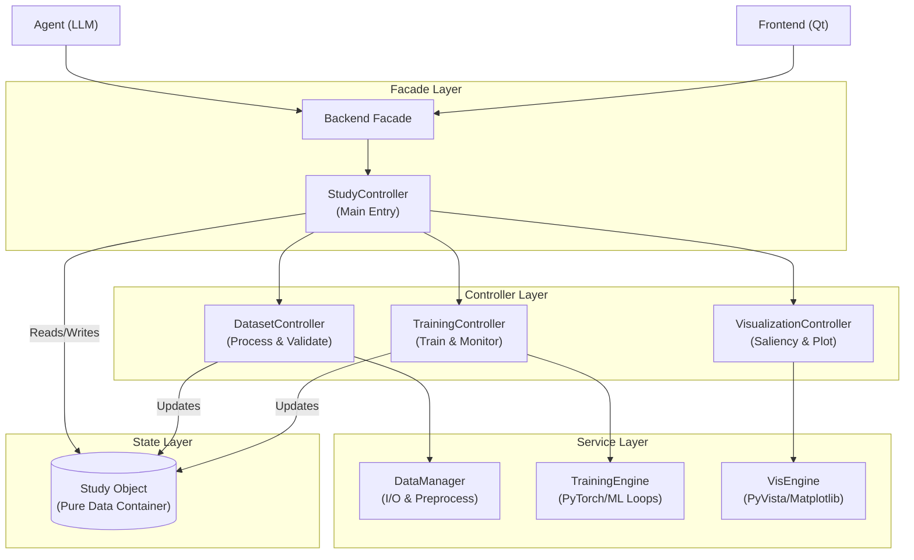

# Backend 架構詳細說明 (Backend Architecture Details)

**狀態**: Draft for v1.0.0
**對應階段**: Phase 1 (Foundation & Reliability)

## 1. 核心設計理念 (Core Design Principles)

Backend 採用 **Controller-Service-Repository** 分層架構，旨在解決舊版 `Study` 物件過度臃腫的問題。
- **無狀態邏輯 (Stateless Logic)**：所有業務邏輯移至 Controller。
- **單一信任源 (Single Source of Truth)**：`Study` 僅作為純數據容器 (Data Class)，不包含任何處理邏輯。
- **強型別協議 (Typed Protocol)**：模組間通訊採用 Pydantic 模型定義標準介面。

---

## 2. 系統架構圖 (System Architecture)



---

## 3. 主要組件詳解 (Component Details)

### 3.1 Study (狀態容器)
**職責**：僅負責持有運行時數據，不包含業務邏輯。
- **性質**：Pydantic Model 或具備 `slots` 的 Data Class。
- **內容**：
  - `datasets: Dict[str, Dataset]` - 已載入的腦波數據集。
  - `models: Dict[str, Model]` - 模型實例。
  - `results: List[Result]` - 分析結果與 Metrics。
  - `config: StudyConfig` - 當前實驗配置。

### 3.2 Controllers (業務邏輯核心)
**職責**：接收指令，協調 Service，並更新 Study 狀態。

#### `StudyController` (主控制器)
- **功能**：協調子控制器，管理 Study 生命週期（Create, Load, Save）。
- **關鍵方法**：
  - `create_study(name: str)`
  - `load_study(path: str)`

#### `DatasetController` (數據控制器)
- **功能**：處理資料載入、預處理管線 (Pipeline) 與品質驗證。
- **關鍵方法**：
  - `load_data(path: str, type: str)`
  - `apply_preprocessing(pipeline: List[Operation])`
  - `split_data(ratio: float)`

#### `TrainingController` (訓練控制器)
- **功能**：管理訓練迴圈、驗證與模型儲存。具備**異步執行**能力。
- **關鍵方法**：
  - `start_training(config: TrainConfig)`
  - `stop_training()`
  - `get_progress() -> ProgressStatus`

### 3.3 DataManager (資料服務)
**職責**：底層 I/O 操作與高效能運算。
- **功能**：讀取 GDF/EDF/MAT 檔案，執行透過 Numpy/MNE 實作的數學運算。
- **特性**：無狀態，純粹的 Input-Output 函數集合。

---

## 4. Agent 交互協議 (Agent Interaction Protocol)
Agent 不直接呼叫 Controller，而是透過標準化的 **JsonCommand** 進行操作。

### Command 範例
```json
{
  "action": "preprocess",
  "params": {
    "method": "bandpass_filter",
    "low_freq": 1.0,
    "high_freq": 40.0
  }
}
```

### Response 範例
```json
{
  "status": "success",
  "data": {
    "channels_removed": ["Fp1", "Oz"],
    "remaining_quality": 98.5
  },
  "message": "Filtering completed successfully."
}
```

---

## 5. 擴充規範 (Extension Guide)
若要新增新的分析功能（如新的濾波器或模型）：
1. 在 `DataManager` 中實作底層算法。
2. 在 `DatasetController` 或 `TrainingController` 中暴露調用介面。
3. 更新 `Agent` 的工具定義 (Tool Definition) 以支援新指令。
