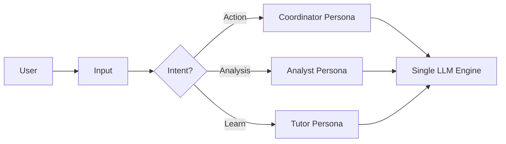

# ADR-002: 多 Agent 架構策略 (Multi-Agent Architecture Strategy)

## 背景 (Context)
使用者建議將 Agent 系統擴展為 **多 Agent (Multi-Agent)** 架構，並具備專業分工：
1.  **協調者 (Coordinator Agent)**: 處理一般請求與工具執行 (目前的實作)。
2.  **分析師 (Analyst Agent)**: 專精於解讀 Saliency Maps 與數值分析。
3.  **導師 (Tutor Agent)**: 作為 EEG 初學者的導師，解釋概念。

## 分析 (Analysis)

### 1. 專業化的價值
單一全能的 System Prompt ("你是一個什麼都懂的專家...") 隨著功能增加，效能通常會下降。
- **分析師需求**: 嚴謹的邏輯、統計詞彙、存取數據矩陣。
- **導師需求**: 親切語氣、高度依賴 RAG (概念解釋)、極少使用工具。
- **協調者需求**: 高精度的 JSON 生成能力、簡潔輸出。

將其拆分可以透過客製化 System Prompt 與 Context 管理來提升效能。

### 2. 資源限制 (The Resource Constraint)
XBrainLab 是在 **本地端 (Local GPU)** 運行的。
- **真正的多 Agent** (同時運行 3 個模型實例) 在 VRAM 限制下不可行。
- **序列載入** (卸載 Agent A, 載入 Agent B) 太慢 (10-30秒延遲)。

### 3. 解決方案：虛擬多 Agent (Virtual Multi-Agent / Persona Switching)
因為我們控制了 `PromptManager`，我們可以利用 **單一模型** 搭配 **動態 System Prompts** 來實作 "虛擬 Agent"。

#### 架構更新
- **路由器 (Intent Classifier)**: 一個輕量級步驟 (或正則表達式) 來分類使用者意圖：
    - `"幫我處理..."` -> **Coordinator**
    - `"為什麼圖表長這樣？"` -> **Analyst**
    - `"什麼是 ICA？"` -> **Tutor**
- **PromptManager 中的狀態機**:
    - `PromptManager` 不再只有一個靜態 `SYSTEM_PROMPT`，而是維護一個 Persona 註冊表。
    - `get_messages()` 根據當前 Persona 選擇對應的 System Prompt。

## 實作路線圖 (Implementation Roadmap)
1.  **擴充 PromptManager**: 支援 `set_persona(name)` 與多重模板。
2.  **RAG 整合**:
    - **Tutor** 可存取 `concepts_db`。
    - **Coordinator** 可存取 `tools_db`。
    - **Analyst** 可存取 `current_active_data`。
3.  **記憶體範圍 (Memory Scoping)**: 選擇性地隔離對話歷史或共用。通常共用歷史對使用者體驗較好。

## 決策 (Decision)
我們將採用 **虛擬多 Agent 模式 (Virtual Multi-Agent Pattern)**。
我們 **不會** 啟動多個 OS 行程或模型實例。
我們將透過 **Context/Prompt Switching** 來達成專業化。
