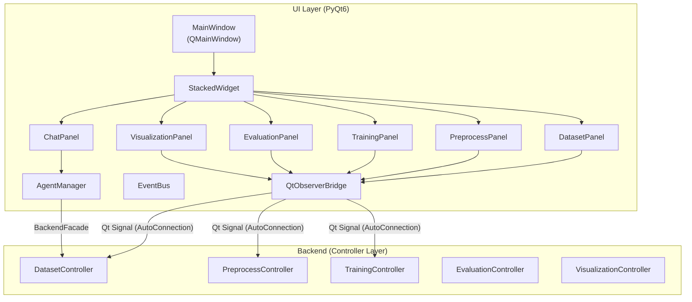

# UI Architecture（前端架構詳解）

**最後更新**: 2026-02-25

## 1. 設計理念

UI 層採用 **事件驅動 + 組合式元件** 架構，基於 PyQt6 構建。

- **純呈現層**: 不直接存取 Backend 資料，僅透過 Controller 取得
- **事件驅動更新**: UI 不主動 polling；Controller 透過 Observable 推送狀態變更
- **執行緒安全**: 透過 `QtObserverBridge` 將背景執行緒事件安全傳入 Qt 主執行緒
- **依賴注入**: 元件接收 Controller 參照，不使用全域狀態
- **統一樣式**: 集中管理 Theme、StyleSheet、Icon

---

## 2. 系統架構圖



---

## 3. 模組結構

```
XBrainLab/ui/
├── __init__.py
├── main_window.py              # QMainWindow (265 行)
│                                 # ├── StackedWidget (面板切換)
│                                 # ├── AgentManager (Agent 生命週期)
│                                 # └── ToolExecutor (Agent 工具分發)
│
├── core/                        # 核心基礎設施
│   ├── base_panel.py            # BasePanel 抽象基類 (init_ui / update_panel)
│   ├── base_dialog.py           # BaseDialog 抽象基類 (統一按鈕行為)
│   ├── observer_bridge.py       # QtObserverBridge (Backend → Qt Signal)
│   ├── event_bus.py             # 全域事件匯流排 (跨面板通訊)
│   ├── utils.py                 # UI 工具函數
│   └── worker.py                # QThread Worker (背景任務)
│
├── styles/                      # 集中樣式管理
│   ├── theme.py                 # 色彩定義 (Colors, Sizes)
│   ├── stylesheets.py           # CSS 類別 (BTN_PRIMARY, BTN_DANGER, etc.)
│   └── icons.py                 # Icon 資源管理
│
├── components/                  # 可重用 Widget（無業務邏輯）
│   ├── agent_manager.py         # Agent 生命週期管理（啟動/停止/模型切換）
│   ├── card.py                  # 通用資訊卡片
│   ├── info_panel.py            # 彙總資訊面板
│   ├── info_panel_service.py    # InfoPanel 資料格式化服務
│   ├── placeholder.py           # 空狀態占位元件
│   ├── plot_figure_window.py    # Matplotlib Figure 視窗
│   └── single_plot_window.py    # 單圖顯示視窗
│
├── dialogs/                     # 所有對話框（一類別一檔案）
│   ├── dataset/                 # 8 個對話框
│   │   ├── import_label_dialog.py
│   │   ├── channel_selection_dialog.py
│   │   ├── data_splitting_dialog.py
│   │   ├── data_splitting_preview_dialog.py
│   │   ├── event_filter_dialog.py
│   │   ├── label_mapping_dialog.py
│   │   ├── manual_split_dialog.py
│   │   └── smart_parser_dialog.py
│   ├── preprocess/              # 5 個對話框
│   │   ├── filtering_dialog.py
│   │   ├── resampling_dialog.py
│   │   ├── rereference_dialog.py
│   │   ├── normalize_dialog.py
│   │   └── epoching_dialog.py
│   ├── training/                # 4 個對話框
│   │   ├── model_selection_dialog.py
│   │   ├── training_setting_dialog.py
│   │   ├── optimizer_setting_dialog.py
│   │   └── device_setting_dialog.py
│   ├── visualization/           # 3 個對話框
│   │   ├── montage_picker_dialog.py
│   │   ├── saliency_setting_dialog.py
│   │   └── export_saliency_dialog.py
│   └── model_settings_dialog.py # 通用模型設定對話框
│
├── panels/                      # 主應用面板
│   ├── dataset/                 # 資料載入面板
│   │   ├── panel.py             # DatasetPanel (組合 Sidebar + Actions)
│   │   ├── sidebar.py           # 檔案列表側欄
│   │   └── actions.py           # 動作處理（載入、標籤、分割）
│   ├── preprocess/              # 預處理面板
│   │   ├── panel.py             # PreprocessPanel
│   │   ├── sidebar.py           # 操作列表側欄
│   │   ├── preview_widget.py    # 即時預覽 Widget
│   │   ├── history_widget.py    # 操作歷史 Widget
│   │   └── plotters/            # 繪圖策略
│   │       └── preprocess_plotter.py
│   ├── training/                # 訓練面板（已完整拆分）
│   │   ├── panel.py             # TrainingPanel (Sidebar + History + Progress)
│   │   ├── sidebar.py           # 訓練設定側欄
│   │   ├── history_table.py     # 訓練歷史表格
│   │   ├── components.py        # 進度顯示元件
│   │   ├── training_manager.py  # 訓練執行管理器
│   │   └── test_only_setting.py # 僅測試模式設定
│   ├── evaluation/              # 評估面板
│   │   ├── panel.py             # EvaluationPanel
│   │   ├── confusion_matrix.py  # 混淆矩陣 Widget
│   │   ├── metrics_table.py     # 指標表格 Widget
│   │   └── metrics_bar_chart.py # 指標長條圖
│   └── visualization/           # 視覺化面板
│       ├── panel.py             # VisualizationPanel
│       ├── control_sidebar.py   # 視覺化控制側欄
│       ├── model_summary.py     # 模型摘要 Widget
│       └── saliency_views/      # 6 個 Saliency 視圖
│           ├── base_saliency_view.py  # 基類
│           ├── map_view.py            # 2D Saliency Map
│           ├── topomap_view.py        # Topomap
│           ├── spectrogram_view.py    # Spectrogram
│           ├── plot_3d_view.py        # 3D 渲染
│           └── plot_3d_head.py        # 3D Head 模型
│
└── chat/                        # AI 對話助手
    ├── panel.py                 # ChatPanel (訊息列表 + 輸入框)
    ├── message_bubble.py        # 單則訊息氣泡 Widget
    └── styles.py                # 對話專用樣式
```

---

## 4. 核心元件詳解

### 4.1 MainWindow

`MainWindow` (265 行) 是 `QMainWindow` 子類別，職責為 **面板編排**，不包含業務邏輯。

**主要組成**:
- `QStackedWidget`: 管理 5 + 1 個面板（Dataset / Preprocess / Training / Evaluation / Visualization + Chat）
- `AgentManager`: 管理 LLM Agent 生命週期（啟動、停止、模型切換）
- `ToolExecutor`: 分發 Agent 工具呼叫到對應 Controller

### 4.2 BasePanel（面板基類）

所有面板繼承 `BasePanel`，強制實作標準介面：

```python
class BasePanel(QWidget):
    def __init__(self, parent=None, controller=None):
        super().__init__(parent)
        self.controller = controller
        # 從 parent 推導 main_window（僅當 parent 含 study 屬性時）
        self.main_window = parent if getattr(parent, "study", None) else None

        # 注意：__init__ 不呼叫 init_ui() 和 _setup_bridges()，
        # 子類別必須在自身初始化完成後顯式呼叫。

    def init_ui(self):               # 子類別覆寫（raise NotImplementedError）
        raise NotImplementedError

    def update_panel(self, *args, **kwargs):  # Controller 事件觸發後的更新
        pass

    def _setup_bridges(self):        # 子類別覆寫以綁定 Controller 事件
        pass

    def _create_bridge(self, controller, event, handler):
        # 便利 helper — 建立 QtObserverBridge 並自動管理生命週期
        bridge = QtObserverBridge(controller, event, self)
        bridge.connect_to(handler)
        self._bridges.append(bridge)
        return bridge

    def set_busy(self, busy: bool):  # 設定忙碌狀態
        ...

    def cleanup(self):               # 清理資源（含 Bridge 清理）
        ...
```

> **注意**: BasePanel 不使用 `ABC` / `@abstractmethod`，而是透過 `NotImplementedError` 強制子類別實作 `init_ui`。

### 4.3 QtObserverBridge（執行緒安全橋接）

解決 Backend 背景執行緒觸發事件 → UI 主執行緒更新 的跨執行緒問題。

```
Backend Thread               Qt Main Thread
     │                            │
Controller.notify("event")        │
     │                            │
     ▼                            │
QtObserverBridge                  │
  ├── pyqtSignal.emit() ──────►  │
  │   (AutoConnection)            ▼
  │                         slot: self.update_panel()
```

實作原理：
- `QtObserverBridge(QObject)` 持有一個 `pyqtSignal`
- `__init__` 時呼叫 `observable.subscribe(event, self._on_event)`
- `_on_event` 透過 `emit()` 將呼叫排入 Qt 事件佇列
- Qt 事件迴圈在主執行緒中執行已連接的 slot
- 使用 `connect_to(slot)` 方法連接目標 slot

> **注意**: 使用 Qt 預設的 `AutoConnection`（跨執行緒時自動退化為 `QueuedConnection`）。

### 4.4 EventBus（全域事件匯流排）

跨面板通訊機制（Singleton `QObject`），透過預定義的 `pyqtSignal` 廣播事件：

```python
class EventBus(QObject):
    status_message = pyqtSignal(str, int)   # 狀態列訊息
    error_occurred = pyqtSignal(str)         # 錯誤通知
    data_refreshed = pyqtSignal()            # 資料刷新
    model_updated  = pyqtSignal(str)         # 模型更新

    @classmethod
    def get_instance(cls) -> "EventBus":    # Singleton
```

使用方式：
```python
EventBus.get_instance().status_message.emit("載入完成", 3000)
EventBus.get_instance().data_refreshed.connect(self._on_refresh)
```

### 4.5 AgentManager（Agent 生命週期）

管理 LLM Agent 的啟動/停止/模型切換：
- `start_system()` — 啟動 Agent 系統
- `stop_generation()` — 停止當前生成
- `set_model(model_name)` — 切換 LLM 模型
- `handle_user_input(text)` — 處理使用者輸入
- `start_new_conversation()` — 開始新對話
- 與 ChatPanel 連接，透過 BackendFacade 執行 Agent 工具呼叫

---

## 5. 面板組成模式

每個面板遵循一致的 **Sidebar + Content + Bridge** 組合模式：

```
┌──────────────────────────────────────────┐
│ Panel (BasePanel 子類別)                  │
├──────────┬───────────────────────────────┤
│ Sidebar  │ Content Area                  │
│          │ ┌───────────┬───────────────┐ │
│  設定     │ │ Widget A  │   Widget B    │ │
│  動作按鈕 │ │ (Table)   │   (Chart)     │ │
│  狀態列   │ └───────────┴───────────────┘ │
├──────────┴───────────────────────────────┤
│ _setup_bridges() → QtObserverBridge      │
└──────────────────────────────────────────┘
```

| 面板 | Sidebar | 主要 Widget | Controller 事件 |
|------|---------|------------|----------------|
| DatasetPanel | 檔案列表、匯入按鈕 | Actions (載入/標籤/分割) | `data_changed`, `import_finished` |
| PreprocessPanel | 操作列表 | PreviewWidget, HistoryWidget | `preprocess_changed` |
| TrainingPanel | 訓練設定 | HistoryTable, Components | `training_started/updated/stopped` |
| EvaluationPanel | — | ConfusionMatrix, MetricsTable, BarChart | `config_changed` |
| VisualizationPanel | ControlSidebar | 6 個 Saliency 視圖 | — |

---

## 6. 樣式系統

### 三層架構
| 層級 | 檔案 | 內容 |
|------|------|------|
| Theme | `styles/theme.py` | 色彩常數 (`PRIMARY`, `DANGER`, `BG_DARK`, ...) |
| Stylesheet | `styles/stylesheets.py` | CSS 類別 (`BTN_PRIMARY`, `TABLE_ROW`, ...) |
| Icon | `styles/icons.py` | Icon 資源載入與快取 |

使用方式：
```python
from XBrainLab.ui.styles import Stylesheets, Theme
button.setStyleSheet(Stylesheets.BTN_PRIMARY)
label.setStyleSheet(f"color: {Theme.TEXT_SECONDARY};")
```

---

## 7. 擴充指南

### 新增面板
1. 建立 `panels/<domain>/panel.py`，繼承 `BasePanel`
2. 實作 `init_ui()` 和 `update_panel()`
3. 在 `_setup_bridges()` 中綁定 Controller 事件
4. 在 `MainWindow` 的 `StackedWidget` 中註冊

### 新增對話框
1. 建立 `dialogs/<domain>/<name>_dialog.py`，繼承 `BaseDialog`
2. 實作 `init_ui()` 和 `_on_confirm()`
3. 在對應 Panel 的 Actions 中呼叫

### 修改樣式
1. 顏色 → 修改 `styles/theme.py`
2. CSS → 修改 `styles/stylesheets.py`
3. 避免在元件中直接寫 inline style
