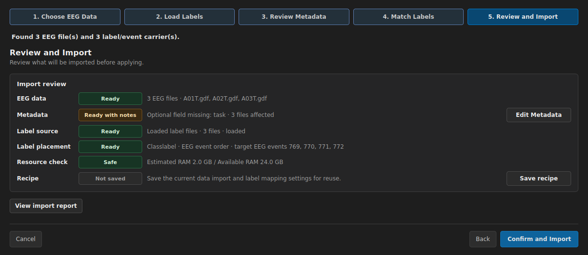

# Graz 2a: GDF Recordings with MAT Labels

  
Paradigm<strong>Motor imagery</strong>

  
Route scope<strong>A01T, A02T, A03T</strong>

  
Source pattern<strong>GDF + external MAT</strong>

  
Published evidence<strong>Unverified</strong>

This page is a reviewable import route for three Graz / BCI Competition IV 2a training
recordings. It does not claim that an identified manual run completed preprocessing,
training, evaluation, or saliency.

## Run this dataset

### Source and version

- **Source:** BCI Competition IV Dataset 2a training recordings and matching label files.
- **Page scope:** `A01T.gdf`, `A02T.gdf`, `A03T.gdf` with `A01T.mat`, `A02T.mat`, `A03T.mat`.
- **Version status:** no dataset revision or file hash is published with this page.
- **Before launch:** record where the files came from and hash the six selected files.

### App action

1. Open **Dataset** in the XBrainLab development build.
2. Choose **Import folder**, then keep only the three GDF recordings in the selected scope.
3. In **Load Labels**, load the folder containing the three MAT files.
4. Move through **Review Metadata**, **Match Labels**, and **Review and Import** without
   confirming until every check below matches.

### Choices

- Pair each MAT file to the GDF file with the same subject stem.
- Use the external values as class labels only after checking the dataset protocol.
- For this route, review **EEG event order** placement against cue codes `769`, `770`,
  `771`, and `772`; do not assume every event in the GDF is a class event.
- Treat subject/session meaning encoded in filenames as a decision to review, not as
  automatically complete metadata.

### Expected checkpoint

Before import, the screen should show:

- selected EEG scope: `A01T.gdf`, `A02T.gdf`, `A03T.gdf`;
- one MAT label file paired to each GDF recording;
- label use: class label;
- placement: EEG event order with cue codes `769`–`772`;
- no unresolved blocker in **Review and Import**.

<figure class="product-shot desktop-shot" markdown>
  
  <figcaption>Open the original image to read the controls. It illustrates the values to check and is not identified completion evidence.</figcaption>
</figure>

  <strong>Check values without relying on the screenshot</strong>

  - EEG data: **3 files**.
  - Label source: **3 loaded files**, paired by subject stem.
  - Label placement: **Class label · EEG event order · 769/770/771/772**.
  - Recipe: optional; **Not saved** must not be mistaken for an import blocker.

### Stop condition

Stop before **Confirm and Import** when any filename is missing, a MAT file pairs to the
wrong subject, the expected cue events are absent, label/event counts are implausible,
or metadata meaning cannot be justified from the dataset documentation.

### Next step

After you independently verify the import review, confirm the import and open
**Preprocess**. This page does not prescribe Graz-specific filters, epochs, split,
model, evaluation, or saliency settings; do not treat later stages as a validated route.

## Evidence identity

  Unverified

  | Identity field | Published value |
  | --- | --- |
  | Manifest ID | Not published |
  | App revision | Not published |
  | Run ID | Not published |
  | Dataset revision | Not published |
  | Evidence files | None published |

The page remains **Unverified** because no single publication record binds the dataset
revision, app revision, manual run, and evidence files. The execution instructions may
be used to create such a record later; they are not a substitute for it.

## Evidence and limits

### Source and dataset

Unverified

The page names a source and six expected files, but their hashes and dataset revision
are not published together.

### Import scope

Unverified

The route defines an exact three-recording scope. No identified manual run is published
to prove that scope was applied on a particular app revision.

### Labels and metadata

Unverified

The page defines the pairing and review choices. It does not publish a run record that
proves the resulting label alignment or metadata values.

### Preprocess

Unverified

No Graz-specific operation sequence, parameters, or before/after review is published.

### Epoch

Unverified

No event window, baseline, rejection policy, or class-count checkpoint is published.

### Split

Unverified

No subject-, session-, or competition-protocol split is published for this route.

### Model and training

Unverified

No identified model run, settings, seed, split membership, or training result is published.

### Evaluation

Unverified

No held-out score, confusion matrix, or class-level result is published.

### Saliency

Unverified

No Graz-specific saliency result with trained-run, input, method, montage, and channel
identity is published.

### Reproducibility and limitations

Unverified

This route does not establish compatibility with every GDF/MAT schema, a complete
competition protocol, model generalization, or physiological interpretation. A future
publication record must identify every stage it promotes beyond **Unverified**.

[Return to all dataset routes](index.md){ .md-button }
