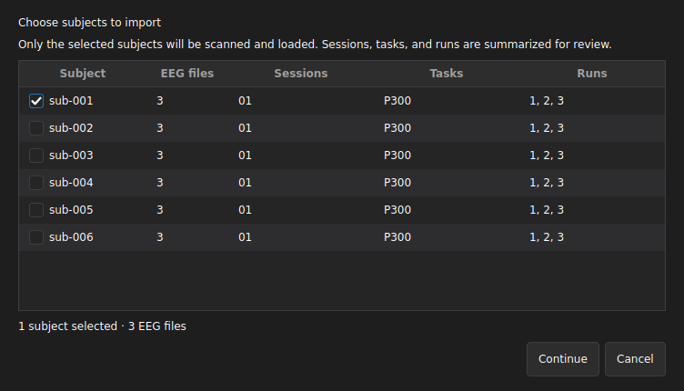

# OpenNeuro ds003061: P300 BIDS

  
Paradigm<strong>Auditory P300</strong>

  
Route scope<strong>sub-001 · ses-01 · runs 1–3</strong>

  
Source pattern<strong>BIDS · SET + events.tsv</strong>

  
Published evidence<strong>Unverified</strong>

This page is a bounded import route for one subject in OpenNeuro `ds003061`. It does not
claim that an identified manual run completed import, epoching, training, evaluation,
or saliency.

## Run this dataset

### Source and version

- **Source:** OpenNeuro dataset `ds003061`.
- **Page scope:** subject `sub-001`, session `01`, task `P300`, runs `1`, `2`, and `3`.
- **Expected files:** one EEGLAB SET recording and one `events.tsv` carrier per run.
- **Version status:** no OpenNeuro snapshot, dataset revision, or file hash is published
  with this page. Record the downloaded snapshot before import.

### App action

1. Open **Dataset** in the XBrainLab development build.
2. Choose **Import BIDS** and select the dataset root.
3. In the subject selector, check only `sub-001`, then continue to the import review.
4. Review the selected entities, event carriers, metadata, and label choices before
   confirming the import.

### Choices

- Keep only `sub-001` selected for this route.
- Confirm session `01`, task `P300`, and runs `1`, `2`, `3` in the scope summary.
- Pair each SET recording with the `events.tsv` file from the same run.
- Select a class column only after checking the dataset documentation. This page does
  not prescribe an event column or class map without a published evidence identity.

### Expected checkpoint

Before the full import scan, the subject selector should show:

- `sub-001` checked and all other subjects unchecked;
- **1 subject selected**;
- **3 EEG files**;
- session `01`, task `P300`, runs `1, 2, 3` for `sub-001`.

<figure class="product-shot product-shot--compact desktop-shot" markdown>
  
  <figcaption>Open the original image to read the selector. It illustrates the scope checkpoint and is not identified completion evidence.</figcaption>
</figure>

  <strong>Check values without relying on the screenshot</strong>

  - Selected subject: **sub-001 only**.
  - Selected scope: **1 subject · 3 EEG files**.
  - Entities: **session 01 · task P300 · runs 1, 2, 3**.
  - Label carrier: one matching **events.tsv** per selected run.

### Stop condition

Stop before import when more than one subject enters the scan, the selector does not
show three runs, a SET/`events.tsv` pair is missing, entity values differ from the
recorded scope, or the class column cannot be justified from the dataset documentation.

### Next step

After you independently verify the subject and event-carrier scope, continue through
**Review and Import**. This page does not prescribe P300-specific preprocessing, epochs,
split, model, evaluation, or saliency settings; do not treat later stages as a validated
route.

## Evidence identity

  Unverified

  | Identity field | Published value |
  | --- | --- |
  | Manifest ID | Not published |
  | App revision | Not published |
  | Run ID | Not published |
  | Dataset revision | Not published |
  | Evidence files | None published |

The page remains **Unverified** because no single publication record binds the OpenNeuro
snapshot, app revision, manual run, and evidence files. No event count or performance
number is published without that identity.

## Evidence and limits

### Source and dataset

Unverified

The page identifies `ds003061` and a subject/run scenario, but no dataset snapshot or
file hashes are published with it.

### Import scope

Unverified

The route defines one subject and three runs. No identified manual run proves that this
scope was applied on a particular app revision.

### Labels and metadata

Unverified

The page requires one run-matched event carrier and reviewed BIDS entities. It does not
publish a class column, class map, imported event count, or alignment result.

### Preprocess

Unverified

No ds003061-specific filtering, rereferencing, resampling, normalization, or channel
review is published.

### Epoch

Unverified

No event window, baseline, rejection policy, or class distribution is published.

### Split

Unverified

No run-, session-, or subject-level split is published for this route.

### Model and training

Unverified

No identified model run, settings, seed, split membership, or training result is published.

### Evaluation

Unverified

No held-out score, confusion matrix, or class-level result is published.

### Saliency

Unverified

No ds003061-specific saliency result with trained-run, input, method, montage, and
channel identity is published.

### Reproducibility and limitations

Unverified

This route does not establish full BIDS validation, compatibility with arbitrary P300
datasets, model generalization, or physiological interpretation. A future publication
record must identify every stage it promotes beyond **Unverified**.

[Return to all dataset routes](index.md){ .md-button }
