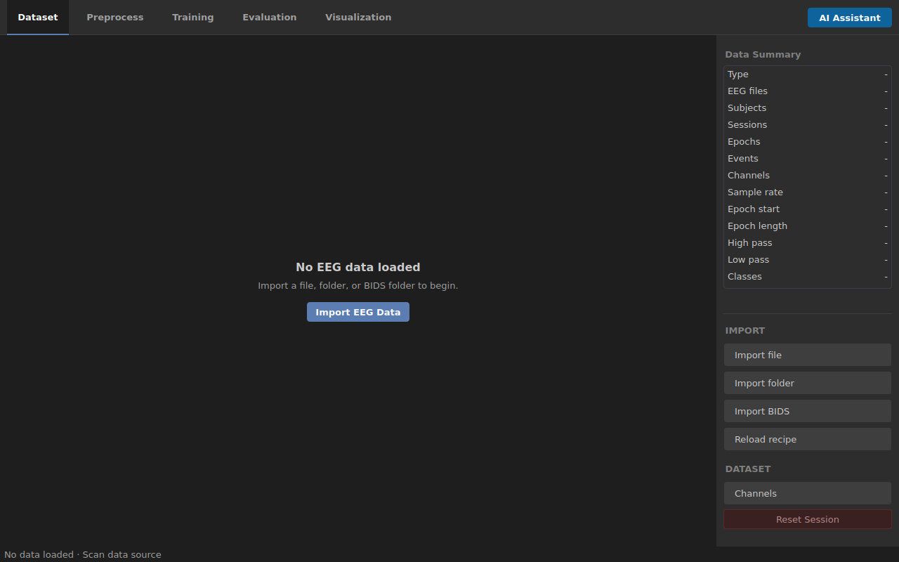

---
hide:
  - navigation
---

# Getting Started

<p class="page-kicker">From source checkout to a reviewed import</p>

<p class="portal-lede">Set up the development build, confirm the empty Dataset
workspace, and import a small EEG scope whose labels and metadata you can explain.</p>

<div class="setup-path" markdown>
  <div><span>1</span><strong>Install</strong><small>Prepare the managed environment.</small></div>
  <div><span>2</span><strong>Launch</strong><small>Confirm the Dataset workspace opens.</small></div>
  <div><span>3</span><strong>Review</strong><small>Apply an import only after its scope is clear.</small></div>
</div>

!!! note "Development distribution"
    The current project does not ship a signed installer, so setup uses the repository
    environment. The optional assistant is not required for the EEG workflow.

## Before you begin

You need:

- Python `3.11` or `3.12`.
- Poetry for the managed environment.
- Enough local storage for the scientific Python stack and your EEG data.
- EEG recordings you are permitted to process.
- Label/event files and protocol notes when the recording does not contain complete
  class semantics.

Do not configure or download a local language model merely to use import,
preprocessing, epoching, training, evaluation, or visualization.

## Install the application environment

From the XBrainLab repository root:

```bash
poetry install
```

To include the optional local assistant runtime:

```bash
poetry install --with llm
```

These commands describe the development distribution. A general-purpose Windows
installer, code signing, and first-run setup have not been released.

## Launch XBrainLab

Use the managed environment:

```bash
poetry run -- python run.py
```

A configured project machine may also have the repository's Windows-to-WSL launcher.
That launcher is environment-specific; its presence is not evidence that another
machine has been installed correctly.

When the window opens, confirm that you can see the five workflow tabs:

`Dataset` · `Preprocess` · `Training` · `Evaluation` · `Visualization`

<figure class="product-shot desktop-shot" markdown>
  [](assets/screenshots/desktop-start.png)
  <figcaption>Open the original image to read the controls. A new session begins in Dataset; disabled downstream actions are expected.</figcaption>
</figure>

<div class="screen-checks" markdown>
  <strong>Startup check values</strong>

  - Selected tab: **Dataset**.
  - Empty state: **No EEG data loaded**.
  - Available source actions: **Import file**, **Import folder**, **Import BIDS**, **Reload recipe**.
</div>

## Prepare a first dataset

Keep the initial scope small and interpretable:

1. Start with one subject or a few known runs.
2. Place protocol notes beside your working copy of the data.
3. Identify whether labels are embedded events, annotations, or separate files.
4. Know which event or column represents the analysis class.
5. Decide which metadata must be preserved for the intended split.
6. Keep the source data unchanged; write recipes and outputs elsewhere.

For a known route, use either the [Graz 2a](case-studies/graz-2a.md) or
[OpenNeuro P300](case-studies/openneuro-ds003061.md) case study as a review checklist.

## Complete the first import

In **Dataset**, select the import action that matches the source:

| Source | Use |
| --- | --- |
| One EEG recording | **Import file** |
| Several recordings in a normal folder | **Import folder** |
| A BIDS dataset root | **Import BIDS** |
| A previously reviewed import | **Reload recipe** |

The import review contains five tasks:

1. **Choose EEG Data**: verify the exact selected scope.
2. **Load Labels**: use discovered carriers, add label files, or continue without labels.
3. **Review Metadata**: inspect subject, session, task, and run identity.
4. **Match Labels**: confirm carrier pairing, class source, and placement.
5. **Review and Import**: resolve blockers and confirm only when the summary matches the study.

<figure class="product-shot desktop-shot" markdown>
  [](assets/screenshots/import-review.png)
  <figcaption>Open the original image to inspect the review rows. Required readiness is separate from optional recipe saving.</figcaption>
</figure>

<div class="screen-checks" markdown>
  <strong>Import review check values</strong>

  - **EEG data**, **Label source**, and **Label placement** match the intended scope.
  - **Metadata** notes are understood before import.
  - **Resource check** is safe for the selected data.
  - **Recipe: Not saved** is optional and does not imply an import failure.
</div>

## Confirm a usable session

After import, check the **Data Summary** before proceeding:

- EEG file count matches the selected scope.
- Subject/session/task/run values match the study, when available.
- Event and class counts are plausible for the protocol.
- Channel count and sampling rate match the acquisition.
- Warnings are understood and recorded.

If those facts are wrong, correct the import before preprocessing. If epochs or a
training plan already exist, close and reopen XBrainLab before loading a different study;
do not silently replace upstream data.

[Continue with the development-build workflow](workflow.md){ .md-button .md-button--primary }
