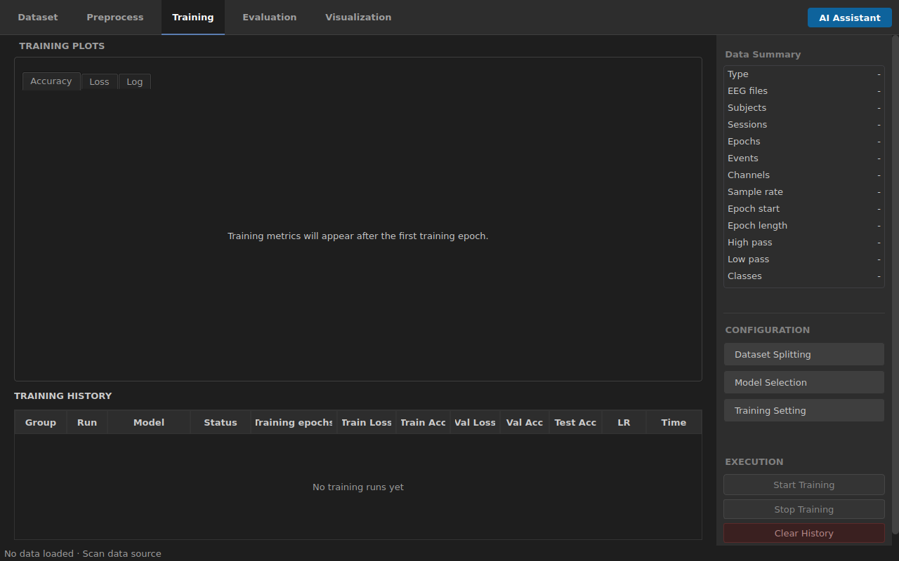
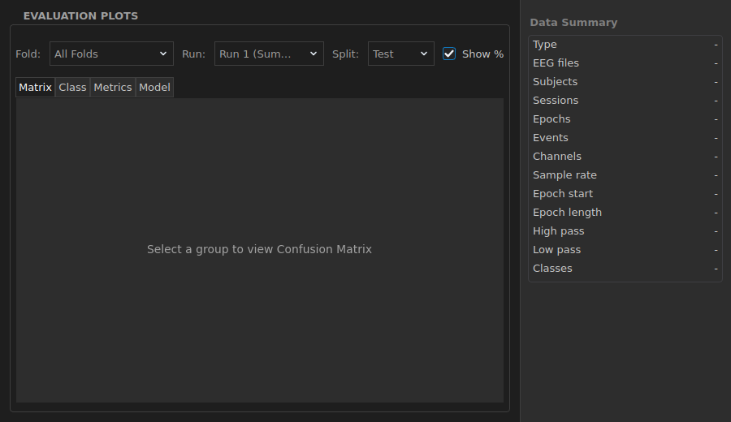

---
hide:
  - navigation
---

# Desktop Workflow

Eight stages · one dependency-ordered run

Each stage should leave enough context for the next stage to
explain what data, settings, and run it is using. Continue only when the review values
and stop conditions for the active stage are clear.

| Stage | Main question | Continue when |
| --- | --- | --- |
| Dataset import | What recordings, events, and metadata are active? | The import review matches the intended scope. |
| Preprocess | What signal changes were applied? | The signal and operation history are plausible. |
| Epoch | Which event and time window define a trial? | Epoch count and timing match the protocol. |
| Split | What unit is held out? | The split respects subject/session boundaries and avoids leakage. |
| Train | Which model and settings produced this run? | The run finishes and its provenance is retained. |
| Evaluate and explain | What does this result cover? | Metrics and saliency are read against the correct fold, run, split, and data. |

<ol class="mobile-stage-list">
  <li><strong>Dataset import</strong>Check which recordings, events, and metadata are active. Continue only when the import review matches the intended scope.</li>
  <li><strong>Preprocess</strong>Check which signal changes were applied. Continue only when the signal and operation history are plausible.</li>
  <li><strong>Epoch</strong>Check the event and time window that define a trial. Continue only when timing and counts match the protocol.</li>
  <li><strong>Split</strong>Check which unit is held out. Continue only when subject/session boundaries and leakage controls match the question.</li>
  <li><strong>Train</strong>Check which model and settings produced the run. Continue only when the run identity and terminal state are retained.</li>
  <li><strong>Evaluate and explain</strong>Read metrics or saliency only against the correct fold, run, split, and data.</li>
</ol>

<nav class="page-jumps" aria-label="Workflow sections" markdown>
[Import](#1-import-and-interpret-the-dataset) ·
[Preprocess](#2-preprocess-while-preserving-intent) ·
[Epoch](#3-create-epochs) ·
[Split](#4-generate-and-split-the-dataset) ·
[Train](#5-configure-and-run-training) ·
[Evaluate](#6-evaluate-in-run-context) ·
[Visualize](#7-inspect-saliency-and-visualization) ·
[Reproduce](#8-reproduce-or-revise)
</nav>

## 1. Import and interpret the dataset

Import is a review workflow, not a file-open shortcut. Use the five import steps to
make selected scope, label source, metadata, and placement decisions explicit.

Pay particular attention to:

- **Selected scope**: selected files or BIDS subjects, not merely the folder scanned.
- **Label carrier**: embedded event, annotation, MAT variable, table column, or BIDS
  `events.tsv`.
- **Placement**: how label rows align to event order, event code, onset, or interval.
- **Class map**: which source values become analysis classes.
- **Metadata**: subject, session, task, and run identity needed by later splits.

The review may be **Ready**, **Ready with notes**, require a decision, or be blocked.
Do not treat a warning as harmless until its downstream effect is understood.

<figure class="product-shot desktop-shot" markdown>
  
  <figcaption>Open the original image to read every row. Confirm only after scope and label semantics match the study.</figcaption>
</figure>

  <strong>Import screen checks</strong>

  - Review rows cover EEG data, metadata, label source, label placement, and resources.
  - A blocking row must be resolved before **Confirm and Import**.
  - Recipe saving remains an optional reuse action.

## 2. Preprocess while preserving intent

Open **Preprocess** after the import is applied. Available operations include filtering,
resampling, rereferencing, and normalization. The exact sequence is a research choice,
not a universal preset.

Before applying an operation:

1. Record why it is needed for this protocol.
2. Check units, sampling rate, and channel types.
3. Inspect the signal preview before and after the operation.
4. Confirm the history shows the intended order.
5. Avoid learning preprocessing parameters from the held-out evaluation data.

Normalization can be applied at an epoch-aware stage. Verify where an operation is
executed rather than inferring it from its name alone.

## 3. Create epochs

**Create EEG Epochs** converts continuous data or reviewed events into trial windows.
The event selection, start time, end time, baseline, and boundary handling must come
from the study protocol.

Check:

- the selected anchor event is a trial anchor rather than a response or boundary;
- the time window captures the intended physiological response;
- rejected boundary epochs are expected and documented;
- each class has a plausible count;
- no subject/session identity was lost during epoch creation.

Once epochs or downstream datasets exist, XBrainLab locks upstream edits that would
invalidate them. Reset deliberately when an import or preprocessing choice must change.

## 4. Generate and split the dataset

Use the dataset/training configuration to select the split strategy. A random
trial-level split can leak subject- or session-specific structure, so match the held-out
unit to the research question.

| Research question | Typical held-out unit to consider |
| --- | --- |
| Generalize to unseen trials from known recordings | Trial, with leakage checks |
| Generalize to another run or visit | Run or session |
| Generalize to unseen participants | Subject |
| Estimate within-subject adaptation | Explicit within-subject train/validation/test design |

Confirm that every fold contains the intended classes and that preprocessing fitted
parameters do not cross the split boundary.

## 5. Configure and run training

In **Training**:

1. Open **Dataset Splitting** and verify the fold/run plan.
2. Open **Model Selection** and choose an available model appropriate to the data shape.
3. Open **Training Setting** and review epochs, optimizer-related settings, batch size,
   and execution resources.
4. Start training and monitor the accuracy, loss, log, and history views.
5. Stop the run if the configuration, resource use, or data provenance is wrong.

<figure class="product-shot desktop-shot" markdown>
  
  <figcaption>Open the original image to inspect the empty controls. This illustrates prerequisites, not a completed result.</figcaption>
</figure>

  <strong>Training screen checks</strong>

  - Configuration actions: **Dataset Splitting**, **Model Selection**, **Training Setting**.
  - **Start Training** remains unavailable until all prerequisites exist.
  - Empty plots and history are control states, not dataset results.

Training curves are diagnostics. They do not establish generalization, significance,
or suitability for a scientific claim.

## 6. Evaluate in run context

Open **Evaluation** after a compatible training result exists. Select the fold, run,
and split before reading the matrix, class-level values, metrics, or model details.

<figure class="product-shot product-shot--compact desktop-shot" markdown>
  
  <figcaption>Open the original image to read the selectors. It illustrates result scope controls, not a dataset metric.</figcaption>
</figure>

  <strong>Evaluation screen checks</strong>

  - Select **Fold**, **Run**, and **Split** before reading a result.
  - Matrix, class, metrics, and model tabs must refer to the same selection.
  - An empty panel or selector is not completion evidence.

An **All Folds** summary is meaningful only when the application can establish that
the underlying test masks and cohorts are compatible. Preserve per-fold results for
auditing even when a summary is available.

## 7. Inspect saliency and visualization

The **Visualization** workspace can present saliency maps, spectrograms, topographic
maps, and a 3D view when the required data exists. Select the trained fold/run and
method before interpreting an image.

Saliency is sensitive to model state, input scaling, channel order, montage, and the
chosen method. Display normalization changes the rendering scale; it does not improve
the attribution or alter its source values.

!!! warning "Interpretability boundary"
    A visually coherent saliency map is not evidence that the model learned a valid
    physiological mechanism. Compare methods, inspect stability, preserve the model
    and input identity, and validate against protocol knowledge.

## 8. Reproduce or revise

Save the import recipe when the data interpretation will be reused. A reloaded recipe
must be reviewed again because source files, metadata, parser behavior, or software may
have changed.

For a reproducible run, retain at least:

- source dataset identity and selected scope;
- label carriers, class map, and confirmed placement;
- import recipe and warnings;
- preprocessing sequence and parameters;
- epoch and rejection settings;
- split membership or fold record;
- model and training settings;
- software revision and runtime environment;
- evaluation and saliency selection context.

[Compare the dataset case studies](case-studies/index.md){ .md-button }
